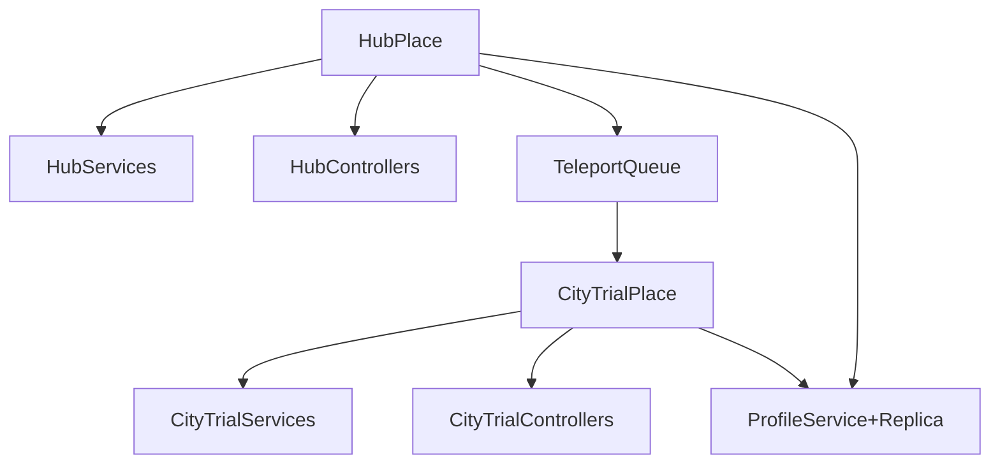

# Hub + CityTrial Experience -- Overview

## High-level concept

- **Hub place**: A social lobby where players can freely roam, view leaderboards, access an in-game shop, and queue at teleporters.
- **CityTrial place**: A separate Roblox place focused on moment-to-moment gameplay (city-based trials) that players are teleported into from the hub.
- **Goal**: Reuse as many existing systems as possible (`CustomPackages`, `Packages`, Quenty `node_modules`) instead of inventing new patterns.

## World layout and places

- **Hub place**
  - Lives as the **primary place** of the experience.
  - Environment: open roaming area with clear points of interest (leaderboards, shop, teleporters, NPCs).
  - Uses **Knit services/controllers** under `src/ServerStorage/ServerServices/HubServices` and `src/StarterPlayerScripts/ClientControllers/HubControllers`.
- **CityTrial place**
  - Implement as a **secondary place** in the same Roblox experience (with its own Rojo project / place entry if needed).
  - Has its **own Knit services and controllers**, likely under `CityTrialServerServices` / `CityTrialControllers` folders mirroring the hub structure.
- **Teleport relationship**
  - Hub teleport pads/queue zones send parties to CityTrial using **TeleportService** plus existing `CustomPackages/TeleportQueue` logic.

## Core shared systems

- **Player data and progression**
  - Use `CustomPackages/ProfileService` wrapper for **persistent player profiles** (currencies, unlocks, cosmetics, stats).
  - Mirror important state to clients via `CustomPackages/Replica` so both hub and CityTrial can show current stats (e.g. currency in UI, recent scores).
- **Architecture**
  - Use `Packages/Knit.lua` for all new services/controllers.
  - Use `Packages/Signal.lua` for events and `Packages/Trove.lua` for lifecycle/cleanup (per-player, per-session, per-queue instances).
- **Zones & interaction points**
  - Use `CustomPackages/ZoneRoot` to define **zones for teleport queues**, shop interaction radii, and special lobby areas.
- **UI**
  - Use `CustomPackages/FusionRoot` for **reactive UI** (leaderboards, queue status, currency display, shop, CityTrial HUD) to keep client state clean.

## File / folder structure for new code

Following the existing project convention where server services live under `src/ServerStorage/ServerServices/<PlaceName>Services/` and client controllers live under `src/StarterPlayerScripts/ClientControllers/<PlaceName>Controllers/`.

### Existing code to leverage

The project already has relevant services and controllers that should be referenced, extended, or refactored rather than rewritten from scratch:

- **`src/ServerStorage/ServerServices/HubWorldServices/`**: Already contains `TeleporterService.lua`, `VehicleService.lua`, `PlayerConfigService.lua`, `ItemService.lua`, `WeaponsService.lua`, and a `Vehicles/` subfolder with `StatDecorators.lua`, `StatsModule.lua`, `VehicleClass.lua`.
- **`src/StarterPlayerScripts/ClientControllers/HubWorldControllers/`**: Already contains `TeleporterGUIController.lua`, `MachineVisualController.lua`, and a `Vehicles/` subfolder with `VehicleMovementPhysicsController.lua`, `CameraVehicleController.lua`, `VehicleConfigController.lua`, `VehicleVisualController.lua`, `spring.lua`.
- **`src/ServerStorage/ServerServices/DungeonPlaceServices/`**: Already contains `MachineService.lua`, `MeteorService.lua`, `patchZoneService.lua`, `DisasterEventService.lua`, `GameManagerService.lua`, and more -- many of which map closely to our CityTrial plan.
- **`src/StarterPlayerScripts/ClientControllers/DungeonControllers/`**: Already contains `MachineController.lua`, `PatchUIController.lua`, `SpeedometerController.lua`, `CameraController.lua`, `GameManagerController.lua`, `IrisController.lua`, `IrisInitController.lua`.
- **`src/ReplicatedStorage/PatchesModule.lua`**: Already exists as a shared patches module.

### New / modified files

**Shared (`src/ReplicatedStorage/`)**

- `MachinePhysicsConfig.lua` -- shared vehicle physics constants table; read by `MachineController` each frame, written by iris debug panel (new)
- `MachinesConfig.lua` -- machine definitions (base stats, model paths, unlock requirements) (new or extend existing)
- `PatchesConfig.lua` -- patch type definitions (stat deltas, caps, spawnWeights, respawnDelay, targetPatchCount) (new or extend `PatchesModule.lua`)
- `ShopConfig.lua` -- shop item definitions (prices, types)
- `TeleportConfig.lua` -- place IDs, queue settings
- `EventsConfig.lua` -- event type pool (hazards, environment changes, timing rules)
- `GameConfig.lua` -- global settings (PhysicsMode toggle, HUD layout defaults, timers)
- `ProfileConfig.lua` -- profile schema definition and version

**Hub server services (`src/ServerStorage/ServerServices/HubServices/`)**

- `HubProfileService.lua` -- profile loading, Replica creation, currency/XP APIs (new)
- `HubShopService.lua` -- purchase validation, item granting (new)
- `HubGarageService.lua` -- machine selection, ownership validation (new)
- `HubQueueService.lua` -- teleporter queue management, countdown, batching (extend existing `TeleporterService.lua`)
- `HubLeaderboardService.lua` -- OrderedDataStore reads, caching (new)
- `Vehicles/StatDecorators.lua` -- already exists, extend with new decorator types
- `Vehicles/StatsModule.lua` -- already exists, extend with `RecalculateStats` helper
- `Vehicles/VehicleClass.lua` -- already exists, extend or reference

**Hub client controllers (`src/StarterPlayerScripts/ClientControllers/HubControllers/`)**

- `HubHUDController.lua` -- always-on currency/XP/status HUD (new)
- `HubShopController.lua` -- Fusion shop UI (new)
- `HubGarageController.lua` -- Fusion machine selection/preview UI (new)
- `HubQueueController.lua` -- Fusion queue/countdown UI (extend existing `TeleporterGUIController.lua`)
- `HubLeaderboardController.lua` -- Fusion leaderboard display (new)
- `Vehicles/` -- already exists with movement, camera, visual controllers; extend as needed

**CityTrial server services (`src/ServerStorage/ServerServices/CityTrialServices/`)**

- `CityTrialMatchService.lua` -- match lifecycle, readiness, countdown, phase management (new)
- `CityTrialMachineService.lua` -- machine spawning, stats, patches, damage, respawn (new)
- `CityTrialEventService.lua` -- random event scheduling, hazard spawning (new)
- `CityTrialPatchSpawnService.lua` -- patch part pool, spawn position selection, respawn timers, budget management (new)
- `CityTrialRewardService.lua` -- end-of-match reward computation and profile writes (new)
- `CityTrialPlayerService.lua` -- per-player session setup, profile binding (new)

**CityTrial client controllers (`src/StarterPlayerScripts/ClientControllers/CityTrialControllers/`)**

- `CityTrialHUDController.lua` -- Fusion HUD (timer, patches, stats, boost, health, events, results) (new)
- `MachineController.lua` -- machine input, physics strategy, state machine (new)
- `CityTrialReadyController.lua` -- client readiness handshake (new)
- `CityTrialCameraController.lua` -- vehicle camera with boost FOV, shake (new)
- `IrisInitController.lua` -- initializes iris once, exposes `GetIris()` (new)
- `IrisDebugPanelController.lua` -- iris debug panel, Studio-only (new)

**Machine physics modules (`src/ReplicatedStorage/` or alongside controllers)**

- `IMachinePhysics.lua` -- interface definition
- `ClientPredictedPhysics.lua` -- client-side physics implementation
- `ServerAuthoritativePhysics.lua` -- server-driven physics implementation
- `MachineInterpolator.lua` -- position interpolation for server-authoritative mode
- `MachineInputMap.lua` -- input binding config for keyboard/gamepad/mobile

## Implementation steps

- **Step 1: Place & Rojo setup** -- Create/confirm hub (primary) and CityTrial (secondary) places with Rojo configs.
- **Step 2: Hub services/controllers** -- Implement HubServices (Profile, Shop, Garage, Queue, Leaderboard) and HubControllers with Fusion.
- **Step 3: CityTrial core** -- Implement CityTrialServices (Match, Machine, Event, Rewards) and CityTrialControllers with Fusion and Input.lua.
- **Step 4: Teleport and queue integration** -- Wire hub teleport pads/zones to TeleportQueue and TeleportService.
- **Step 5: Data & progression glue** -- Finalize profile schema, reward formulas, shop prices, and leaderboards.
- **Step 6: Polish** -- Add camera work, particles, splines, behavior trees, and audio for a polished feel.

## Plan index

All detailed plans are split into focused files:

| File | Topic |
|------|-------|
| [01-ui-design.md](01-ui-design.md) | UI design language, Scale sizing, HUD layouts, mobile, gamepad, Fusion overview, loading screens |
| [02-hub-systems.md](02-hub-systems.md) | Hub join flow, place design, shop + catalog, garage, machine unlocking, leaderboards |
| [03-teleporters-and-queues.md](03-teleporters-and-queues.md) | Matchmaking, teleport flow, queue APIs, batching, zone edge cases, server allocation |
| [04-machines-and-physics.md](04-machines-and-physics.md) | Machine physics, controller, state machine, boost/drift, physics mode toggle, input, camera |
| [05-patches-and-pickups.md](05-patches-and-pickups.md) | Stat patches, spawn mechanics, respawn rules, Decorator pattern, example stats/boosts |
| [06-events-and-hazards.md](06-events-and-hazards.md) | Random events, dynamic environment, hazard warnings, event scheduler |
| [07-health-damage-respawn.md](07-health-damage-respawn.md) | Health/damage system, respawn flow, spectator mode |
| [08-citytrial-match-flow.md](08-citytrial-match-flow.md) | Join/readiness, match start gating, end-of-session, match/player defaults |
| [09-data-and-progression.md](09-data-and-progression.md) | Data/economy, DataStore, profile versioning, XP/leveling, rewards, APIs |
| [10-audio-sfx.md](10-audio-sfx.md) | Audio/SFX (machine, pickups, hazards, UI, music) |
| [11-packages-and-cleanup.md](11-packages-and-cleanup.md) | Package usage summary, promises, Trove/Maid cleanup |
| [12-edge-cases.md](12-edge-cases.md) | All edge cases (UI, hub, CityTrial, cross-cutting) |
| [13-iris-debug-panel.md](13-iris-debug-panel.md) | Iris vehicle debug panel for real-time tuning |
