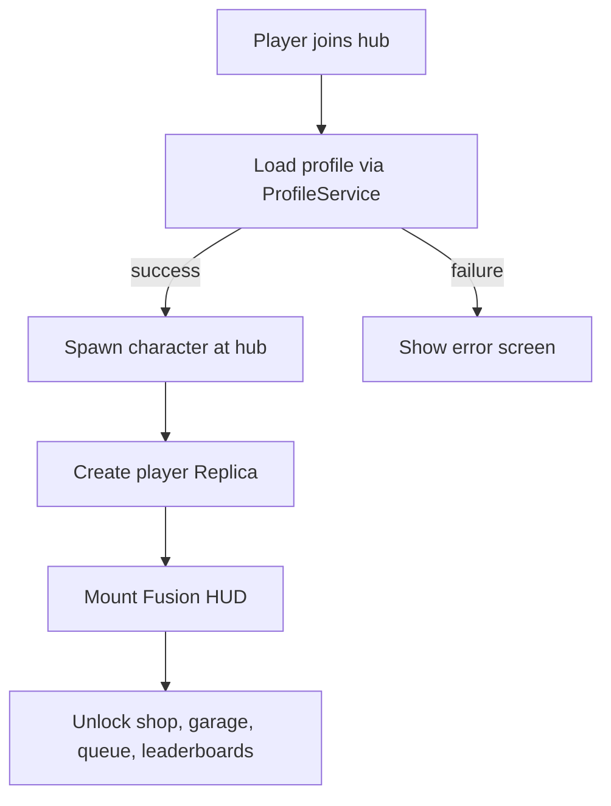

# Hub Systems

## Hub player join flow

When a player first joins the hub (or returns from CityTrial), this flow runs:

- **Step 1: Profile load**
  - `HubProfileService` calls `ProfileService:LoadProfileAsync(userId)`.
  - While loading, the client shows a Fusion **"Loading your data..."** overlay (no shop, queue, or leaderboard access yet).
  - If the profile fails to load after retries, show a **"Data unavailable, please rejoin"** screen and do not proceed.
- **Step 2: Character spawn**
  - Once the profile is loaded, allow the character to spawn at the hub spawn point.
  - If returning from CityTrial (detected via `TeleportData`), optionally spawn at a "return" area near the teleporters.
- **Step 3: Replica creation**
  - `HubProfileService` creates the player's Replica with initial state from the profile (currency, XP, owned machines, equipped cosmetics, selectedMachineId, etc.).
  - Replica begins replicating to the owning client.
- **Step 4: HUD mount**
  - `HubHUDController` detects the Replica and mounts the always-on Fusion HUD:
    - Currency/XP display, machine name/icon, and status indicators.
  - The "Loading" overlay is dismissed.
- **Step 5: Systems unlocked**
  - Player can now:
    - Roam the hub freely.
    - Open the shop (proximity prompt or UI button).
    - View leaderboards.
    - Enter the garage to select a machine.
    - Walk into a teleporter zone to queue for CityTrial.
- **Step 6: Returning from CityTrial (optional extra)**
  - If `TeleportData` from CityTrial contains last-run stats, `HubHUDController` shows a brief **"Last CityTrial run"** toast (rewards earned, patches collected, etc.).




## Hub place design

- **Environment & navigation**
  - Use `CustomPackages/ZoneRoot` to define sub-areas (spawn, shop, leaderboard plaza, teleport area, garage).
- **Leaderboards**
  - Backed by **persistent stats** from `ProfileService` or Roblox DataStores; mirrored via `Replica` to clients.
  - UI built with **Fusion**; a `HubLeaderboardController` reads replicated stats and renders top players / friends.
- **In-game shop**
  - Server: `HubShopService` under `HubServices` receives purchase requests, validates against `ProfileService` balances, and updates profiles.
  - Client: `HubShopController` shows Fusion-based UI: items, prices, equipped status.
  - Use `Replica` to broadcast **currency and inventory changes**.
- **Teleporters & queues**
  - Physically represented teleport pads/portals in the hub environment.
  - Each teleporter has an associated **queue zone** (via `ZoneRoot`) and **queue object** managed by `CustomPackages/TeleportQueue`.
  - `HubQueueService` groups players into parties (e.g. fixed size or time-based batching) and triggers TeleportService to CityTrial.
  - `HubQueueController` shows per-player **queue status** (waiting, teleporting, estimated time) using Fusion UI.

### Machine selection / garage

- **Garage location**
  - A dedicated area or NPC in the hub (detected via `ZoneRoot` proximity or a UI button) opens the garage UI.
- **Server: `HubGarageService`**
  - `HubGarageService:GetOwnedMachines(player) -> { machineId[] }`
  - `HubGarageService:GetSelectedMachine(player) -> machineId`
  - `HubGarageService:SelectMachine(player, machineId: string) -> (success: boolean, reason: string?)`
    - Validates the player owns the machine before allowing selection.
    - Writes `selectedMachineId` to the profile and updates the player Replica.
- **Client: `HubGarageController` (Fusion)**
  - Renders a scrollable list/grid of all machines from `MachinesConfig`.
  - Each machine card shows:
    - Name, model preview or icon, base stats (bars for speed, accel, handling, etc.).
    - "Owned" / "Locked" / "Selected" badge.
  - Selecting an owned machine calls `HubGarageService:SelectMachine` via Knit remote.
  - Locked machines show the unlock requirement (see machine unlocking below).
- **Machine preview (optional)**
  - Spawn a 3D preview of the selected machine in the garage area or use a ViewportFrame in the Fusion UI.

### Machine unlocking

- **Unlock methods (configurable per machine in `MachinesConfig`)**
  - Each machine defines its unlock requirement, one of:
    - `{ type = "shop", price = number }` -- purchased with soft currency via `HubShopService`.
    - `{ type = "level", requiredLevel = number }` -- automatically unlocked when the player reaches a certain XP level.
    - `{ type = "achievement", achievementId = string }` -- unlocked by completing a specific achievement or quest.
    - `{ type = "default" }` -- available to all players from the start (starter machine).
  - At least one machine must be `type = "default"` so every new player has a machine for CityTrial.
- **Unlock flow**
  - When the unlock condition is met (purchase confirmed, level reached, achievement granted), `HubProfileService` adds the `machineId` to the player's `ownedMachines` list in the profile and updates the Replica.
  - `HubGarageController` reacts to the Replica change and updates the UI (machine card transitions from "Locked" to "Owned").
  - If the player has no `selectedMachineId` set (e.g. new player), auto-select the default machine.
- **Profile schema additions**
  - `ownedMachines: { machineId[] }` -- list of unlocked machine IDs.
  - `selectedMachineId: string` -- currently active machine for CityTrial.

## Shop catalog structure

### Item categories

- **Machines**: purchased via currency or unlocked by level/achievement (already covered in Machine Unlocking section). Each machine entry in `ShopConfig` references `MachinesConfig[machineId]`.
- **Trails**: visual particle trails that appear behind the machine during CityTrial. Cosmetic only, no stat effect. Stored as `ownedTrails: { trailId[] }` and `equippedTrailId: string?` in the profile.
- **Machine skins**: alternate color schemes or textures for owned machines. Each skin is tied to a `machineId` and stored as `ownedSkins: { [machineId]: { skinId[] } }` and `equippedSkins: { [machineId]: skinId }`.
- **Titles**: text labels displayed above the player's machine or on the leaderboard (e.g. "Speed Demon", "Patch Collector"). Stored as `ownedTitles: { titleId[] }` and `equippedTitleId: string?`.
- **Boost effects**: cosmetic variations on the boost visual (different particle colors/shapes). Same structure as trails.

### ShopConfig structure

```lua
ShopConfig = {
    items = {
        { id = "trail_fire", category = "trail", displayName = "Fire Trail", price = 500, levelRequired = 5, icon = "rbxassetid://..." },
        { id = "skin_falcon_gold", category = "skin", machineId = "falcon", displayName = "Gold Falcon", price = 1000, levelRequired = 10, icon = "rbxassetid://..." },
        { id = "title_speedDemon", category = "title", displayName = "Speed Demon", price = 300, levelRequired = 0, icon = "rbxassetid://..." },
        -- ...
    },
}
```

### Shop UI behavior

- `HubShopController` groups items by category with tabs or a sidebar.
- Each item card shows: icon, name, price, level requirement, and ownership/equipped status.
- Items the player cannot afford are shown with a dimmed price. Items below the player's level are shown with a lock icon and "Requires Level X".
- Purchasing calls `HubShopService:Purchase(itemId)`, which validates currency, level, and ownership before granting.
