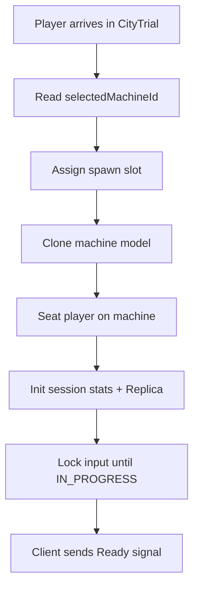

# Machines and Physics

#### Machine physics and controller implementation

- **Physics approach**
  - Use modern Roblox constraints (`LinearVelocity` + `AlignOrientation`) on the machine model for movement, or CFrame-based movement per frame for tighter control.
  - Ground detection via downward raycasts to find surface normal; align machine orientation to the surface for terrain-hugging feel.
  - Slope behavior: slight speed gain downhill, slight speed loss uphill, scaled by `acceleration`.
  - Deceleration / friction: gradual slowdown when throttle is released; coast to a stop over ~2-3 seconds.
  - Braking: optional explicit brake input for faster deceleration.
- **Turning model**
  - Rate-based: turn rate in degrees/sec scales with `handling` stat.
  - Slight speed reduction while turning (e.g. 5-10% penalty at max steer) to reward smooth lines.
  - Heavy machines (`weight` high) feel slightly understeery; light machines feel more responsive.
- **Boost system**
  - Boost meter (0 to 100) charges via: passive `boostChargeRate` per second, bonus charge from drift, and optional charge pickups.
  - Activation: press boost input to consume meter at a fixed drain rate; adds `boostPower` to current `topSpeed` while active.
  - On depletion, boost ends; small cooldown (e.g. 0.5s) before meter begins recharging.
  - VFX: boost trail via `Particles`, slight FOV increase on client, camera shake via `Shake.lua`.
- **Drift system**
  - Activate: hold drift input while steering.
  - Behavior: reduced friction (machine slides outward), tighter visual turning, speed maintained or slightly reduced.
  - Boost charge link: while drifting, `boostChargeRate` is multiplied (e.g. 2x-3x).
  - Exit: release drift input; optionally grant a small mini-boost burst on exit.
- **Airborne / hop behavior**
  - Machines go airborne off ramps or bumps naturally via physics.
  - Air steering: reduced handling (e.g. 50% of ground handling).
  - Glide stat (from `offroadPenalty` / glide patches) can slow fall rate slightly.
  - Landing: small impact effect (particles + shake), brief speed adjustment.
- **Collision response**
  - Machine-to-machine: knockback direction based on relative velocity; magnitude scaled by `weight` difference. Brief stun state (e.g. 0.3-0.5s input lock).
  - Machine-to-wall: speed loss (e.g. 30-50% of current speed), small bounce vector, optional minor damage.
  - Machine-to-destructible obstacle: obstacle breaks, machine loses small speed, particles on impact.
- **Machine state machine**
  - States: `IDLE` (pre-match, input locked), `DRIVING` (normal), `BOOSTING` (boost active), `DRIFTING` (drift active), `AIRBORNE` (off ground), `STUNNED` (post-collision, brief input lock), `DEAD` (health zero), `RESPAWNING` (invulnerability window).
  - Transitions are driven by input + physics conditions (e.g. grounded check, health check, boost meter check).
- **Camera while riding**
  - Third-person follow camera with offset behind and above the machine.
  - During boost: slight FOV increase (e.g. +5-10 degrees) for speed sensation.
  - During collisions/stun: brief camera shake via `Shake.lua`.
  - Free-look: player can rotate camera independently; machine direction is not affected by camera rotation (camera snaps back when released).
- **Input mappings (via `Packages/Input.lua`)**
  - Keyboard: W = throttle, S = brake, A/D = steer, Shift = boost, Space = drift.
  - Gamepad: right trigger = throttle, left trigger = brake, left stick = steer, A/X button = boost, B/O button = drift.
  - Mobile: virtual joystick for steering, right-side buttons for throttle/boost/drift.
  - All mappings defined in a `MachineInputMap` config module, remappable.

#### Physics mode toggle (Strategy pattern)

- `**IMachinePhysics` interface**
  - `init(machineModel, statsProvider) -> ()`
  - `setInput(inputState: { throttle, steer, boost, drift }) -> ()`
  - `update(dt: number) -> ()`
  - `getState() -> { cframe, velocity, grounded, currentSpeed }`
  - `destroy() -> ()`
- **Two implementations**
  - `ClientPredictedPhysics`: client has network ownership, runs physics locally, sends periodic snapshots to server for validation. Server corrects if invalid (speed/position sanity checks).
  - `ServerAuthoritativePhysics`: server keeps network ownership, client sends input state at ~20-30 Hz via unreliable remote, server runs physics and replicates position. Client uses a `MachineInterpolator` to lerp between server updates for smooth visuals.
- **Toggle via `GameConfig.PhysicsMode`**
  - A shared config value (`"ClientPredicted"` or `"ServerAuthoritative"`) read by both `MachineController` (client) and `CityTrialMachineService` (server) at match start.
  - `MachineController` instantiates the correct strategy implementation based on the config.
  - `CityTrialMachineService` sets network ownership and runs validation or full physics accordingly.
  - Default: `"ClientPredicted"` for development and free-roam; can be switched to `"ServerAuthoritative"` for competitive modes or security testing.
- `**MachineInterpolator` (for server-authoritative mode)**
  - Buffers last 2-3 server position/rotation updates.
  - Lerps between them each render frame for smooth visuals.
  - Adds a small intentional delay (~2 server ticks) to always have a next target to interpolate toward.

### CityTrial machine spawn flow

When a player arrives in CityTrial, their machine must be spawned and attached before readiness can be reported:

- **Step 1: Read machine selection**
  - `CityTrialMachineService` reads `selectedMachineId` from the player's profile (loaded via `ProfileService` on join) or from `TeleportData`.
  - If the machine ID is missing or invalid, fall back to the **default machine**.
- **Step 2: Assign spawn slot**
  - Each match session has N spawn points. `CityTrialMatchService` assigns the next available slot to the arriving player.
- **Step 3: Clone and place machine**
  - Clone the machine model from `MachinesConfig[machineId].modelPath`.
  - Position it at the assigned spawn point CFrame.
  - Parent it to workspace (or a match-specific folder managed by the match Trove).
- **Step 4: Seat the player**
  - If the machine uses a `VehicleSeat`, set `Seat:Sit(humanoid)`.
  - If using a custom weld/attachment approach, weld the character's `HumanoidRootPart` to the machine's seat attachment and disable default character movement.
- **Step 5: Initialize session stats**
  - Build `currentStats = deepCopy(MachinesConfig[machineId].baseStats)`.
  - Create/update the per-player machine Replica with `stats`, `patchCounts = {}`, `health = maxHealth`.
- **Step 6: Lock input until match start**
  - Machine input (throttle, steering, boost) is disabled. The player can look around but not move.
  - The client-side `MachineController` observes the match phase Replica and only enables input when phase transitions to `IN_PROGRESS`.
- **Step 7: Signal readiness**
  - Once the machine is spawned, seated, and the client has mounted its HUD + `MachineController`, the client sends its `Ready` signal (feeds into the readiness handshake below).

