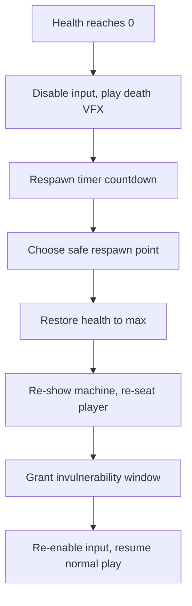

# Health, Damage, Respawn, and Spectator Mode

### Health and damage system

- **Machine health**
  - Each machine has `maxHealth` defined in `MachinesConfig` base stats.
  - Session health starts at `maxHealth` and is tracked in the machine Replica (`health` field).
  - The defense/weight stat from patches (via the decorator chain) can modify effective `maxHealth` or reduce incoming damage.
- **Damage sources**
  - **Hazard events**: meteors, shockwaves, and area damage zones apply flat or percentage-based damage through `CityTrialMachineService:ApplyDamage(player, amount, source)`.
  - **Collisions with environment**: high-speed wall hits apply damage scaled by speed.
  - **Machine-to-machine collisions** (optional): apply knockback + small damage scaled by relative speed and weight difference.
- **Damage flow (server-authoritative)**
  - All damage is applied on the server via `CityTrialMachineService`:
    - `CityTrialMachineService:ApplyDamage(player, rawAmount: number, source: string) -> ()`
    - Computes effective damage after defense modifiers from the decorator chain.
    - Clamps health to `[0, maxHealth]`.
    - Updates the machine Replica `health` field.
    - If `health <= 0`, triggers the **respawn flow**.
  - Client reads `health` from Replica to drive the health bar in the HUD.
- **Healing / repair (optional)**
  - Repair pickups can exist alongside stat patches in the city map.
  - Collected via the same `ZoneRoot`/touch mechanism as patches.
  - `CityTrialMachineService:ApplyHeal(player, amount)` restores health (clamped to `maxHealth`).

### CityTrial respawn flow

When a machine's health reaches zero:

- **Step 1: Death state**
  - `CityTrialMachineService` sets `alive = false` in the machine Replica.
  - Machine input is disabled immediately.
  - Play a **destruction VFX** (explosion particles via `Particles`, camera shake via `Shake.lua`).
  - The machine model is hidden or replaced with a wreck model.
- **Step 2: Respawn timer**
  - A short respawn timer starts (e.g. 3-5 seconds, via `Packages/timer.lua`).
  - `CityTrialHUDController` shows a **"Respawning in X..."** overlay driven by the Replica or a Knit remote.
- **Step 3: Respawn**
  - Choose a respawn point: nearest safe spawn point or a random one away from active hazards.
  - Restore health to `maxHealth`.
  - Re-show the machine model at the respawn point.
  - Re-seat the player.
  - Grant a brief **invulnerability window** (e.g. 2-3 seconds): machine flashes/glows, no damage is applied. Tracked server-side via a flag + timer.
- **Step 4: Resume play**
  - Set `alive = true` in Replica.
  - Re-enable machine input.
  - Invulnerability expires after its timer; normal damage resumes.
- **Patches on death**
  - By default (Kirby-style), the player **keeps all collected patches and derived stats** through respawn.
  - This is a policy choice and can be changed per mode if desired.

## Spectator mode

### When spectating applies

- **Dead players**: while waiting for the respawn timer, the dead player's camera can optionally cycle through other players' machines. A "Spectating: [PlayerName]" label appears in the center of the screen.
- **Late joiners / stale arrivals**: if a player arrives at a CityTrial server where a match is already `IN_PROGRESS`, they enter spectator mode (no machine spawned, free camera or follow-camera on another player). They can wait for the current match to end and potentially join the next one (if sequential matches are supported in the future), or be teleported back to the hub.

### Spectator controls

- **Next / Previous player**: left/right input (A/D, bumpers, or swipe on mobile) cycles through alive players.
- **Free camera**: optionally hold a key (e.g. Tab) to enter a free-flying camera within the map bounds.
- **HUD in spectator mode**: shows the spectated player's name, health, boost, and patch counts (read from their machine Replica). The local player's own HUD elements (if dead) are hidden.

### Implementation

- `CityTrialCameraController` has a `SPECTATE` mode alongside the normal `FOLLOW` mode. When the player dies or joins as a spectator, the controller switches to `SPECTATE` and accepts next/prev input.
- Spectator camera reads position from the spectated player's machine `RootPart` with a slight offset (same third-person follow logic reused).
- Spectating is client-only: no server-side changes needed beyond the machine Replica already being replicated to all clients.
