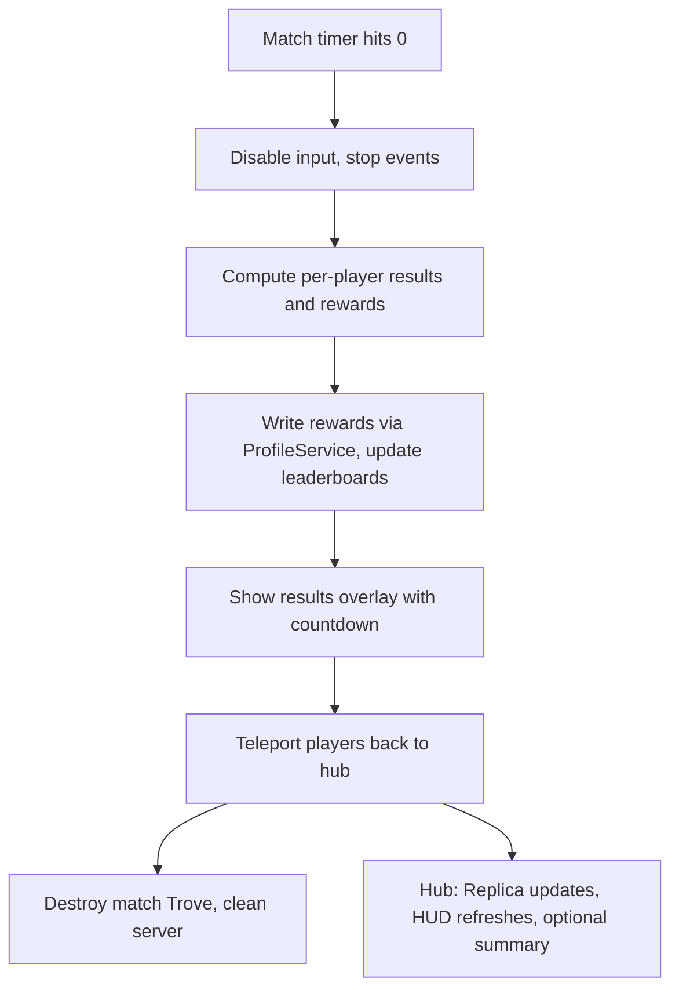

# CityTrial Match Flow

### CityTrial join + load readiness (match start gating)

Roblox cannot perfectly determine when every asset is fully loaded (especially with streaming), so we treat readiness as **server-joined** plus a **client-ready acknowledgement**, both with timeouts. The match start is always a **timer countdown** once we decide to start.

- **TeleportData requirements**
  - Hub includes `partyId`, `expectedUserIds` (or `expectedCount`), and a `seed` in `TeleportData` so CityTrial can assemble the intended group.
- **Phase 1: Joined**
  - CityTrial server creates/looks up a `MatchSession` keyed by `partyId`.
  - As players arrive (`Players.PlayerAdded`), mark them as `joined = true`.
  - Start a **join grace timer** using `Packages/timer.lua` (e.g. 30-60s) to wait for the rest of the expected party.
- **Phase 2: Ready**
  - Each client sends a `Ready` signal after it is "ready enough":
    - `game:IsLoaded()` is true
    - character exists / spawned
    - critical UI is mounted (Fusion HUD)
    - optionally `ContentProvider:PreloadAsync` for a small set of critical assets only
  - Server marks `ready = true` per player.
  - Start a **ready grace timer** (also via `Packages/timer.lua`) to avoid waiting forever on one client.
- **Start decision (always leads to a countdown)**
  - When either:
    - all expected players are `ready`, **or**
    - join/ready grace timers expire but at least `minPlayers` are present,
  - then begin the **match start countdown** (e.g. 10s) using `Packages/timer.lua`.
  - During countdown, keep players in a safe spawn zone (see below) and optionally disable combat/interaction until `IN_PROGRESS`.
- **Spawn safety**
  - Use a CityTrial `SpawnZone` (via `ZoneRoot`) or controlled spawn points so teleported players cannot immediately fall/die while loading.
  - Keep the match in `LOBBY` until the countdown completes; then transition to `IN_PROGRESS`.

#### CityTrial readiness APIs (server + client)

- **Server: `CityTrialMatchService`**
  - `CityTrialMatchService:InitFromTeleportData(teleportData) -> matchId`
  - `CityTrialMatchService:ReportPlayerJoined(player, matchId) -> ()`
  - `CityTrialMatchService:ReportPlayerReady(player, matchId) -> ()`
  - `CityTrialMatchService:_StartJoinGraceTimer(matchId, seconds) -> ()`
  - `CityTrialMatchService:_StartReadyGraceTimer(matchId, seconds) -> ()`
  - `CityTrialMatchService:_BeginStartCountdown(matchId, seconds) -> ()` (uses `Packages/timer.lua`)
  - `CityTrialMatchService:_StartMatch(matchId) -> ()`
- **Client: `CityTrialReadyController` (or part of `CityTrialHUDController`)**
  - On controller start, wait for readiness conditions, then call:
    - `CityTrialMatchService:ReportReady():RemoteEvent()` (or RemoteFunction ack)

#### Readiness edge cases to handle

- **A player never arrives**: join grace timer expires -> start countdown with those present if `>= minPlayers`, else cancel session and optionally teleport everyone back to hub.
- **A player arrives but never becomes ready**: ready grace timer expires -> start countdown anyway, or remove that player from the match if they are still not ready/connected.
- **Player leaves during join/ready/countdown**: update session counts; if this drops below `minPlayers`, cancel countdown and return to waiting (or end session).
- **Late arrivals**: if a player joins after countdown began, either hold them in spectator/warmup until next round or disallow joining that match (policy decision per mode).

### CityTrial end-of-session flow

When the CityTrial match timer reaches zero, the following flow runs:

- **Step 1: Match ends (server)**
  - `CityTrialMatchService` sets phase to `ENDED` in the match Replica via `Packages/timer.lua` callback.
  - `CityTrialMachineService` disables machine input (no acceleration, boost, or steering) but players can still look around.
  - `CityTrialEventService` stops scheduling new hazards/events; any active hazards are allowed to finish or are cleaned up.
- **Step 2: Freeze state and compute results (server)**
  - Server gathers per-player session metrics:
    - Total patches collected (by type and overall count).
    - Time survived, deaths, damage taken/avoided.
    - Distance traveled, events survived, any special achievements.
  - `CityTrialRewardService` computes rewards:
    - Soft currency, XP, per-machine mastery XP, quest/achievement progress.
  - Rewards are written to `ProfileService` and relevant `OrderedDataStore` leaderboards are updated.
  - Results data is pushed into a per-player Replica (or a dedicated results Replica) so clients can display it.
- **Step 3: Results screen (client, Fusion UI)**
  - `CityTrialHUDController` transitions to a **results overlay**:
    - Displays rewards earned, key stats (patches, events survived, distance), rank changes, and any new unlocks.
  - A **results countdown timer** (e.g. 15-20 seconds, via `Packages/timer.lua`) gives players time to review results.
  - Timer is shown in the results UI so players know when teleport will happen.
- **Step 4: Teleport back to hub**
  - After the results countdown, `CityTrialMatchService` calls TeleportService to send all remaining players back to the hub place.
  - A small `TeleportData` payload is included so the hub can optionally show a "Last run summary" panel on arrival.
  - Teleport failure handling:
    - Retry once automatically.
    - If retry fails, show a clear UI prompt with a manual "Return to Hub" button that the player can press to trigger another teleport attempt.
    - Ensure profile data is already saved before teleport so no rewards are lost regardless of teleport outcome.
- **Step 5: Server-side cleanup**
  - Destroy the match Trove/Maid (all timers, machine models, Replica instances, hazard instances, zone connections).
  - CityTrial server is now clean and can either shut down or accept a new batch of players.
- **Step 6: Hub arrival**
  - When players land back in the hub:
    - Hub profile Replica already reflects new currency/XP/mastery (written before teleport).
    - `HubHUDController` updates automatically via Replica observers.
    - Optionally show a brief "Last CityTrial run" summary toast or panel with key stats from `TeleportData`.
    - Leaderboard displays update on next fetch cycle from `HubLeaderboardService`.

## Match duration and player count defaults

Default values stored in `GameConfig.lua`, tunable without code changes:

- **Match duration**: `GameConfig.matchDurationSeconds = 300` (5 minutes). This is the main CityTrial free-roam timer. Adjustable per mode if multiple modes are added later.
- **Results screen duration**: `GameConfig.resultsDurationSeconds = 15` (15 seconds for reviewing results before teleport back).
- **Match start countdown**: `GameConfig.startCountdownSeconds = 10` (10-second countdown after all players are ready or grace timers expire).
- **Respawn timer**: `GameConfig.respawnSeconds = 4` (4 seconds between death and respawn).
- **Invulnerability window**: `GameConfig.invulnerabilitySeconds = 3` (3 seconds of invulnerability after respawn).
- **minPlayers**: `GameConfig.minPlayers = 2` (minimum players required to start a match; solo play is not supported by default).
- **maxPlayers**: `GameConfig.maxPlayers = 8` (maximum players per CityTrial match / teleport batch).
- **Join grace timer**: `GameConfig.joinGraceSeconds = 30` (time to wait for all expected players to arrive after teleport).
- **Ready grace timer**: `GameConfig.readyGraceSeconds = 15` (time to wait for all joined players to send Ready signal).
- **Hub queue maxWaitTimeSeconds**: `TeleportConfig.maxWaitTimeSeconds = 60` (max time a partially-filled queue waits before teleporting with whoever is present, if >= minPlayers).
- **Hub queue countdownDuration**: `TeleportConfig.countdownDuration = 10` (countdown shown to players in the queue before teleport fires).
