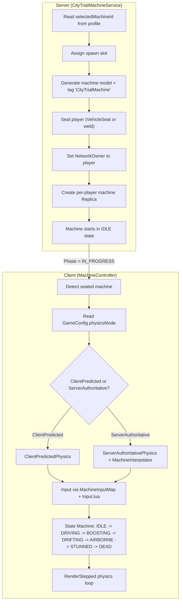

# Phase 5: Machine System Implementation

## Architecture Overview

The machine system spans server and client, using a Strategy pattern for physics mode selection.



## Dependencies (Config + Packages)

All new code, no references to existing vehicle/machine code in the codebase. The CityTrial machine system is built from scratch using:

- **ReplicatedStorage/MachinePhysicsConfig.lua**: All physics constants (maxSpeed, thrust, drag, turn, boost, drift, gravity, hoverHeight, hoverStiffness, hoverDamping, debugRaycasts, voidThreshold, respawnDelay, respawnInvulnDuration, collisionStunDuration, collisionStunThreshold, stuckDetectionTime, surfaceAlignSpeed, etc.)
- **ReplicatedStorage/MachinesConfig.lua**: Machine definitions with base stats (topSpeed, acceleration, handling, weight, boostPower, etc.)
- **ReplicatedStorage/MachineInputMap.lua**: Input bindings for keyboard/gamepad/mobile
- **ReplicatedStorage/GameConfig.lua**: `physicsMode` toggle ("ClientPredicted" / "ServerAuthoritative")
- **Packages**: `Input.lua` (Sleitnick input lib), `Shake.lua` (camera shake), `Trove.lua` (cleanup), `Signal.lua`, `imgizmo.lua` (CeiveImGizmo -- debug raycast visualization, Studio only)
- **CustomPackages**: `ReplicaService` (state replication)

## File Plan

### New Files (8)

| #   | File                                                                                               | Purpose                                                                                                               |
| --- | -------------------------------------------------------------------------------------------------- | --------------------------------------------------------------------------------------------------------------------- |
| 5.1 | `src/ServerStorage/ServerServices/CityTrialServices/CityTrialMachineService.lua`                   | Server: spawn machines, seat players, manage network ownership, per-player machine Replica, damage/heal API           |
| 5.2 | `src/ReplicatedStorage/IMachinePhysics.lua`                                                        | Interface definition for the physics Strategy pattern                                                                 |
| 5.3 | `src/ReplicatedStorage/ClientPredictedPhysics.lua`                                                 | Client-owned physics: thrust, drag, ground sensor, boost, drift. Periodic server snapshot validation                  |
| 5.4 | `src/ReplicatedStorage/ServerAuthoritativePhysics.lua`                                             | Server-owned physics stub + client input sender                                                                       |
| 5.5 | `src/ReplicatedStorage/MachineInterpolator.lua`                                                    | Buffers server position updates, lerps per render frame                                                               |
| 5.6 | `src/StarterPlayerScripts/ClientControllers/CityTrialControllers/MachineController.lua`            | Client controller: state machine, input dispatch, physics strategy instantiation, boost/drift system, mobile controls |
| 5.7 | `src/StarterPlayerScripts/ClientControllers/CityTrialControllers/MobileMachineInputController.lua` | Mobile-specific virtual joystick + action buttons                                                                     |
| 5.8 | `src/StarterPlayerScripts/ClientControllers/CityTrialControllers/MachineCameraController.lua`      | Third-person follow camera, boost FOV, shake, free-look, spectator mode                                              |

### No Existing Files Modified

All new CityTrial machine code goes in the new folders. Existing `DungeonControllers/MachineController.lua` and `HubWorldServices/VehicleService.lua` are untouched.

---

## Detailed Implementation

### 5.1 -- CityTrialMachineService.lua (Server)

Responsibilities:

**Character Loading Strategy:**
- `Players.CharacterAutoLoads = false` -- set in `CityTrialPlayerService` on server init. No characters spawn on join.
- `CityTrialPlayerService` tracks arriving players. Once all expected players have joined (or a join timeout expires, e.g. 15s), it fires an `AllPlayersReady` signal.
- `CityTrialMachineService` listens for `AllPlayersReady` and runs the spawn sequence for all players at once:

**Spawn Sequence (runs once, for all players simultaneously):**
1. For each player, read `selectedMachineId` from session data
2. Assign the next available spawn slot (tagged parts: `MachineSpawnPoint`)
3. **Generate the machine model programmatically** via `_buildMachineModel(machineId, machineConfig)` (no Studio models needed)
4. Position machine at spawn slot, parent to `workspace.CityTrialMachines` folder (auto-created)
5. Anchor the machine's RootPart temporarily (`rootPart.Anchored = true`)
6. Call `player:LoadCharacter()` to spawn the character
7. Wait for `player.CharacterAdded` to fire, then get the Humanoid
8. Seat the player via `seat:Sit(humanoid)`
9. Unanchor the RootPart (`rootPart.Anchored = false`)
10. Set `rootPart:SetNetworkOwner(player)` for client-predicted mode
11. Create a per-player machine Replica (`MachineState` class) with: `machineId`, `stats`, `health`, `maxHealth`, `boostCharge`, `state` (IDLE), `invulnerable`
12. Tag the model with `CityTrialMachine` + `OwnerUserId` attribute for client detection

- Machines start anchored + IDLE so they don't fall or move before everyone is seated
- Once all players are seated: unanchor all, begin match countdown
- On match phase `IN_PROGRESS`: update all machine Replicas to state `DRIVING` (unlock input)

**Late joiners / timeout:**
- If a player hasn't arrived by the join timeout, their slot is skipped (match runs with fewer players)
- If a player joins mid-match (rare, after timeout): spawn their machine, load character, seat immediately, set state to DRIVING

**Seating Safety:**
- After `seat:Sit(humanoid)`, disable jumping: `humanoid.JumpHeight = 0; humanoid.JumpPower = 0`
- Listen to `humanoid.Seated` -- if the player somehow gets unseated (`seated == false`), immediately re-seat via `seat:Sit(humanoid)` (guards against edge cases like seat interaction exploits)
- Listen to `humanoid.Died` -- on death, do NOT let the default death sequence run. Instead: set machine Replica state to `DEAD`, freeze the machine (set `LinearVelocity.LineVelocity = 0`), keep the character seated (or make machine intangible via `CanCollide = false` + invulnerable flag). After `respawnDelay` seconds, call `player:LoadCharacter()` again, re-seat, reposition machine at a safe spawn point, restore state to `DRIVING`
- On `player:LoadCharacter()` failure (pcall wrap): skip that player, log warning, retry once after 1s. If still fails, kick with message.

**Disconnect During Spawn:**
- Wrap the per-player spawn sequence in a check: after each async yield (`CharacterAdded` wait), verify `player.Parent ~= nil` (player still in game). If player left, clean up the machine model immediately and free the spawn slot.

**Network Ownership Maintenance:**
- After setting `rootPart:SetNetworkOwner(player)`, store a connection on `rootPart:GetPropertyChangedSignal("Anchored")` or periodically (every 5s) re-assert `rootPart:SetNetworkOwner(player)` if the physics assembly changes. Wrap in pcall since it can error if the part is anchored or the player left.

**Stored per-player:** `{ model, rootPart, seat, humanoid, replica, trove, stats, connections }`

**Exposed API:** `ApplyDamage(player, amount, source)`, `ApplyHeal(player, amount)`, `GetMachineModel(player)`, `RecalculateStats(player, patchCounts)`, `RespawnMachine(player)`

- On player removing or match end: destroy machine model, clean up Trove, disconnect all connections

**Generated model structure** (all created in code):

```
Model ("Speedster_Machine")
├── RootPart  (Part, PrimaryPart, CanCollide = true, main physics body + collider)
│   ├── Seat  (VehicleSeat, sits on top of RootPart, welded)
│   ├── RootAttachment  (Attachment, anchor point for constraints)
│   ├── DriveForce  (LinearVelocity, Line mode along local forward)
│   └── SteerAlign  (AlignOrientation, OneAttachment mode)
└── (tagged "CityTrialMachine", attribute OwnerUserId)
```

```lua
function CityTrialMachineService:_buildMachineModel(machineId, config)
    local model = Instance.new("Model")
    model.Name = config.displayName .. "_Machine"

    local rootPart = Instance.new("Part")
    rootPart.Name = "RootPart"
    rootPart.Size = Vector3.new(6, 2, 10)
    rootPart.Anchored = false
    rootPart.CanCollide = true
    rootPart.Material = Enum.Material.SmoothPlastic
    rootPart.Parent = model
    model.PrimaryPart = rootPart

    local seat = Instance.new("VehicleSeat")
    seat.Name = "Seat"
    seat.Size = Vector3.new(2, 0.5, 2)
    seat.Transparency = 1
    seat.CanCollide = false
    seat.MaxSpeed = 0
    seat.Torque = 0
    seat.TurnSpeed = 0
    seat.HeadsUpDisplay = false
    seat.Disabled = false
    seat.Parent = rootPart
    seat.CFrame = rootPart.CFrame * CFrame.new(0, 1.5, 0)
    local seatWeld = Instance.new("WeldConstraint")
    seatWeld.Part0 = rootPart
    seatWeld.Part1 = seat
    seatWeld.Parent = rootPart

    local rootAttachment = Instance.new("Attachment")
    rootAttachment.Name = "RootAttachment"
    rootAttachment.Parent = rootPart

    local linearVel = Instance.new("LinearVelocity")
    linearVel.Name = "DriveForce"
    linearVel.Attachment0 = rootAttachment
    linearVel.MaxForce = math.huge
    linearVel.VelocityConstraintMode = Enum.VelocityConstraintMode.Line
    linearVel.LineDirection = Vector3.new(0, 0, -1)
    linearVel.LineVelocity = 0
    linearVel.RelativeTo = Enum.ActuatorRelativeTo.Attachment0
    linearVel.Parent = rootPart

    local alignOri = Instance.new("AlignOrientation")
    alignOri.Name = "SteerAlign"
    alignOri.Attachment0 = rootAttachment
    alignOri.Mode = Enum.OrientationAlignmentMode.OneAttachment
    alignOri.MaxTorque = math.huge
    alignOri.Responsiveness = 15
    alignOri.CFrame = rootPart.CFrame
    alignOri.Parent = rootPart

    return model, rootPart, seat
end
```

Key points:
- **RootPart** is the PrimaryPart, main collider (`CanCollide = true`), and holds everything as children
- **Seat** is parented directly to RootPart (sits on top), welded, invisible, `CanCollide = false`
- **Constraints** (`DriveForce`, `SteerAlign`) and their **Attachment** all live inside RootPart
- The client physics module handles ground detection via `workspace:Raycast` (no ControllerPartSensor)

Constraint roles:
- **LinearVelocity** (Line mode along local forward): client sets `LineVelocity` each frame based on throttle/speed. Roblox handles collision response naturally.
- **AlignOrientation** (OneAttachment mode): client sets `CFrame` each frame for steering rotation + upright alignment to surface normals. Roblox handles the torque smoothly.

### 5.2 -- IMachinePhysics.lua (Shared Interface)

A simple table describing the contract. Not enforced at runtime (Lua doesn't have interfaces), but serves as documentation and a type guide:

```lua
local IMachinePhysics = {}
IMachinePhysics.__index = IMachinePhysics

function IMachinePhysics:init(machineModel, statsProvider) end
function IMachinePhysics:setInput(inputState) end
function IMachinePhysics:update(dt) end
function IMachinePhysics:getState() end  -- returns { cframe, velocity, grounded, currentSpeed, boostCharge }
function IMachinePhysics:destroy() end

return IMachinePhysics
```

### 5.3 -- ClientPredictedPhysics.lua

Implements `IMachinePhysics`. This is the primary physics mode. Built from scratch using constraint-based physics:

**Core approach:**
- Player has network ownership of the machine's `RootPart`
- Each frame, the client updates two constraints on the RootPart:
  - `LinearVelocity` (Line mode, local forward axis): set `LineVelocity` = current target speed
  - `AlignOrientation` (OneAttachment): set target `CFrame` = computed orientation from steering + surface normal alignment
- Roblox physics engine handles collision response, gravity, and constraint solving naturally

**Ground Raycasts (5-point):**
Raycasts fire downward (`-Y`) from 5 positions in the machine's local space each frame:
```
local RAY_OFFSETS = {
    Vector3.new(0, 0, 0),         -- center
    Vector3.new(-2.5, 0, -4),     -- front-left
    Vector3.new( 2.5, 0, -4),     -- front-right
    Vector3.new(-2.5, 0,  4),     -- back-left
    Vector3.new( 2.5, 0,  4),     -- back-right
}
```
- **RaycastParams**: `FilterType = Enum.RaycastFilterType.Exclude`, filter list = local machine model, all character models, `CityTrialMachines` folder (so machines don't detect each other as ground), any parts tagged `RaycastIgnore` (patches, VFX, hazard volumes). Rebuilt when machines or characters are added/removed.
- Origin: `rootPart.CFrame * CFrame.new(offset).Position`
- Direction: `Vector3.new(0, -(hoverHeight * 2.5), 0)` (ray length = 2.5x hover height for ramp look-ahead)
- `grounded` = at least 1 ray hit within `hoverHeight * 1.3`
- **Surface normal**: average the hit normals of all rays that hit. Weighting: front rays 1.0, back rays 1.0, center 0.5 (prevents center from dominating on ledges)
- **Hover correction**: compare closest hit distance to `hoverHeight`. If too low, apply an upward force proportional to the deficit. If too high (but still grounded), let gravity pull it down. Uses a spring-like formula: `force = stiffness * (hoverHeight - hitDist) - damping * verticalVelocity`
- **Airborne**: if no rays hit, skip surface alignment and apply full gravity + `airHandlingMultiplier`

**Debug Visualization (imgizmo, Studio only):**

Toggled via iris debug panel or a `debugRaycasts` flag in `MachinePhysicsConfig`. Only runs when `RunService:IsStudio()`. Uses `Packages/imgizmo.lua` (CeiveImGizmo) in immediate mode -- draw every frame, auto-cleans.

```lua
local Gizmo = require(Packages.imgizmo)

local RAY_COLORS = {
    Color3.fromRGB(255, 255, 0),   -- center: yellow
    Color3.fromRGB(0, 255, 100),   -- front-left: green
    Color3.fromRGB(0, 200, 80),    -- front-right: green
    Color3.fromRGB(255, 130, 0),   -- back-left: orange
    Color3.fromRGB(255, 170, 0),   -- back-right: orange
}
local HIT_COLOR    = Color3.fromRGB(255, 50, 50)
local NORMAL_COLOR = Color3.fromRGB(50, 150, 255)
local MISS_COLOR   = Color3.fromRGB(100, 100, 100)

function ClientPredictedPhysics:_debugDrawRaycasts(rays)
    for i, ray in rays do
        local origin = ray.origin
        local hit = ray.result  -- RaycastResult or nil

        Gizmo.PushProperty("AlwaysOnTop", true)

        if hit then
            -- Ray line (colored per-offset)
            Gizmo.PushProperty("Color3", RAY_COLORS[i])
            Gizmo.Ray:Draw(origin, hit.Position)

            -- Hit sphere
            Gizmo.PushProperty("Color3", HIT_COLOR)
            Gizmo.VolumeSphere:Draw(CFrame.new(hit.Position), 0.3)

            -- Surface normal arrow (blue, 3 studs long)
            Gizmo.PushProperty("Color3", NORMAL_COLOR)
            Gizmo.Arrow:Draw(hit.Position, hit.Position + hit.Normal * 3, 0.15, 0.4, 8)

            -- Distance label
            Gizmo.PushProperty("Color3", Color3.new(1, 1, 1))
            Gizmo.Text:Draw(hit.Position + Vector3.new(0, 0.5, 0), string.format("%.1f", ray.distance))
        else
            -- Miss: gray line to max ray length
            Gizmo.PushProperty("Color3", MISS_COLOR)
            Gizmo.Ray:Draw(origin, ray.endPos)
        end
    end
end
```

Per frame this draws up to:
- 5 ray lines (colored by offset position)
- Up to 5 red spheres at hit points
- Up to 5 blue normal arrows showing surface direction
- Up to 5 distance labels

Call `Gizmo.Init()` once in `MachineController:KnitStart()` (guarded by `RunService:IsStudio()`).

**Physics per-frame:**
1. **Ground detection**: fire 5 raycasts (above), compute `grounded`, averaged surface normal, hover correction force. If `debugRaycasts`, call `_debugDrawRaycasts`.
2. **Speed calculation**: compute target speed from `inputState.throttle`, current `topSpeed` (from stats), `acceleration`, drag, slope influence
3. **Steering**: compute yaw rotation delta from `inputState.steer * handling * turnSpeed * dt`. Apply `turnSpeedPenalty` to speed while turning.
4. **Surface alignment**: lerp the machine's up vector toward the averaged ground normal for terrain-hugging
5. **Hover**: apply vertical spring force to maintain `hoverHeight` above ground
6. **Set constraints**: write `LinearVelocity.LineVelocity` and `AlignOrientation.CFrame`
7. **Lateral damping**: add a second `LinearVelocity` in Plane mode (or use `VectorForce`) to kill sideways slide. In drift mode, reduce this damping by `driftFrictionMultiplier`.

**Stat scaling** (all from `statsProvider()` which returns effective stats after patches):
- `topSpeed` -> max `LineVelocity`
- `acceleration` -> how quickly speed ramps toward topSpeed
- `handling` -> turn rate multiplier
- `weight` -> affects knockback from collisions (higher = less knockback)
- `boostPower` -> added to topSpeed while boosting
- `boostChargeRate` -> passive meter charge per second

**Drift mode** (when `inputState.drift == true`):
- Lateral damping reduced by `driftFrictionMultiplier` (machine slides outward)
- Turn rate multiplied by `driftTurnMultiplier` (tighter visual turn)
- Boost charge rate multiplied by `driftBoostChargeMultiplier`

**Braking**: when `inputState.brake == true`, apply `brakeDeceleration` to rapidly reduce speed

**Air handling**: when not grounded, turn rate reduced by `airHandlingMultiplier`

**Periodic server validation** (every 2s):
- Client sends `{ position, velocity, speed }` via unreliable remote
- Server checks speed sanity (`< maxSpeed * 1.5`), position bounds
- If invalid, server corrects by setting CFrame

### 5.4 -- ServerAuthoritativePhysics.lua

Stub implementation for future competitive mode:
- Client sends raw input state at 20-30Hz via unreliable remote
- `update(dt)` is a no-op on client (server runs physics)
- `getState()` reads from interpolated state (via MachineInterpolator)
- `init()` does NOT set network owner to player (server keeps it)

### 5.5 -- MachineInterpolator.lua

For server-authoritative mode only:
- Buffers last 2-3 server CFrame/velocity updates
- `pushState(cframe, velocity, timestamp)`
- `getInterpolated(renderTime)` -- lerps between buffered states
- 2-tick intentional delay for smooth interpolation

### 5.6 -- MachineController.lua (Client Controller)

The main client-side Knit controller. Responsibilities:

**Machine Detection:**
- Wait for a model tagged `CityTrialMachine` where the local player is seated
- Or listen to `CityTrialMachineService` Replica for the player's machine assignment

**Physics Strategy:**
- Read `GameConfig.physicsMode`
- Instantiate `ClientPredictedPhysics` or `ServerAuthoritativePhysics`
- Call `physics:init(model, statsProvider)`

**State Machine:**
```
IDLE -> DRIVING (match phase IN_PROGRESS)
DRIVING -> BOOSTING (boost input + charge > 0)
DRIVING -> DRIFTING (drift input held while steering)
DRIVING/BOOSTING/DRIFTING -> AIRBORNE (not grounded)
AIRBORNE -> DRIVING (landed)
ANY -> STUNNED (collision knockback, 0.3-0.5s)
STUNNED -> DRIVING (stun timer expires)
ANY -> DEAD (health <= 0, from Replica)
DEAD -> IDLE (respawn, from Replica)
```

**Input Handling:**
- Use `Packages/Input.lua` to detect preferred input type (keyboard/gamepad/touch)
- Map inputs via `MachineInputMap`
- Build `inputState = { throttle, steer, boost, drift, brake }` each frame
- In IDLE/DEAD/STUNNED states, zero out input

**Boost System:**
- Meter: 0 to `MachinePhysicsConfig.maxBoostCharge`
- Passive charge: `boostChargeRate` per second (from stats)
- Drift bonus: charge rate * `driftBoostChargeMultiplier` while drifting
- Activate: press boost key -> consume meter at `boostDecay` rate, add `boostThrust` to forward force
- On depletion: `boostCooldown` seconds before recharging resumes
- VFX: FOV increase (`boostFOVIncrease`), `Shake.lua` shake

**Drift System:**
- Hold drift input while steering
- Physics layer applies `driftFrictionMultiplier` (less lateral grip = slide) and `driftTurnMultiplier` (tighter visual turn)
- On release: optional mini-boost (`miniBoostOnDriftExit` seconds of boost burst)

**Per-Frame Loop (RenderStepped):**
1. Gather input
2. Update state machine transitions
3. Call `physics:setInput(inputState)`
4. Call `physics:update(dt)`
5. Read `physics:getState()` for HUD/camera data
6. Update boost charge meter
7. Expose state via `GetCameraState()` for `MachineCameraController`

**Cleanup:** Trove destroys physics, connections, UI on match end.

### 5.7 -- MobileMachineInputController.lua

Only active when `Input.PreferredInput` is Touch:
- Creates a floating virtual joystick on the left side (steering + optional throttle)
- Right side: 3 action buttons (Boost, Drift, Brake) from `MachineInputMap.mobile.buttons`
- If `autoThrottle` is true, throttle is always 1.0 (player only steers + uses abilities)
- Exposes `GetInput() -> { throttle, steer, boost, drift, brake }` for `MachineController` to read

### 5.8 -- MachineCameraController.lua (Client Controller)

A Knit controller that manages the camera while the player is riding a machine. Replaces Roblox's default camera entirely during CityTrial.

**Follow Mode (default):**
- Third-person camera positioned behind and above the machine's RootPart
- Offset: configurable `Vector3.new(0, 8, 20)` (up 8 studs, back 20 studs from the machine's rear)
- Camera looks at a point slightly ahead of the machine (not directly at it) for a more dynamic feel
- Position smoothed via lerp/SmoothDamp each frame so the camera doesn't jerk on collisions
- Camera respects ground: raycast from target position to camera position; if blocked by geometry, pull camera closer to avoid clipping

**Boost FOV:**
- Normal FOV: 70
- On boost: lerp FOV to 70 + `MachinePhysicsConfig.boostFOVIncrease` (default 10) over 0.2s
- On boost end: lerp back to 70 over 0.4s
- Uses Fusion `Spring` or manual lerp for smooth transitions

**Camera Shake:**
- On collision/stun: trigger `Shake.lua` with amplitude proportional to impact force
- On meteor/shockwave nearby: trigger shake via event from `CityTrialEventController`
- Shake applied additively on top of the follow position/rotation

**Free-Look:**
- Hold right mouse button (desktop) or right stick (gamepad) to rotate camera independently
- Machine steering is NOT affected by camera rotation during free-look
- On release: camera smoothly snaps back to behind the machine over 0.3-0.5s
- During free-look, follow offset rotates around the machine based on input delta

**Spectator Mode:**
- Activated when the player is in DEAD state (or optionally via a toggle)
- Camera detaches from the local player's machine and follows another player's machine
- Next/Previous player cycling via keybinds (Q/E or bumpers)
- Spectated player's name displayed as a BillboardGui or HUD label
- On respawn: camera snaps back to the local player's machine

**Per-Frame Loop (RenderStepped, after MachineController):**
1. Read machine state from `MachineController` (position, velocity, isBoosting, isStunned, isDead)
2. If spectating: follow spectated target instead
3. Compute target camera CFrame from follow offset + free-look rotation
4. Apply ground-clip correction
5. Apply FOV (boost lerp)
6. Apply shake offset
7. Set `workspace.CurrentCamera.CFrame` and `workspace.CurrentCamera.FieldOfView`

**Integration with MachineController:**
- `MachineController` exposes `GetCameraState() -> { rootCFrame, velocity, isBoosting, isStunned, isDead, currentSpeed }`
- `MachineCameraController` calls this each frame
- On match end (ENDED/RESULTS phase): camera freezes at current position or does a slow cinematic pull-back

---

## Workspace Setup Note

The implementation expects tagged parts in the CityTrial place:

- **`MachineSpawnPoint`** tag: 8 parts (one per max player). The service assigns them round-robin. If none exist, falls back to spawning in a circle around `Vector3.new(0, 5, 0)`.
- **`CityTrialMachines`** folder: auto-created in workspace by the service to hold spawned models.
- **No pre-built models needed**: all machine geometry is generated programmatically. Visual differentiation (size, color) can be driven by `MachinesConfig` fields later.

---

## Integration Points

- **CityTrialMatchService**: `MatchStarted` signal triggers machine state unlock (IDLE -> DRIVING). `MatchEnded` triggers cleanup.
- **CityTrialPlayerService**: `PlayerLoaded` triggers machine spawn. Session data tracks `machineId`.
- **CityTrialPatchSpawnService**: On patch collect, calls `CityTrialMachineService:RecalculateStats(player, patchCounts)` to rebuild the decorator chain and update the machine Replica.
- **CityTrialEventService**: Meteor/shockwave/hazard damage calls `CityTrialMachineService:ApplyDamage(player, amount, source)`.
- **CityTrialHUDController**: Reads machine Replica for health bar, boost meter, stat display.
- **MachineCameraController**: Reads `MachineController:GetCameraState()` each frame. Receives shake triggers from `CityTrialEventController`.
- **Analytics**: `Analytics.MatchJoined(player, machineId)` fired on spawn.

---

## Edge Cases & Handling

### E1. VehicleSeat Built-In Driving
**Problem:** VehicleSeat has `MaxSpeed`, `Torque`, `TurnSpeed` that respond to WASD/gamepad and fight with our custom constraint physics.
**Handling:** Set `MaxSpeed = 0`, `Torque = 0`, `TurnSpeed = 0`, `HeadsUpDisplay = false` on creation (done in `_buildMachineModel`). The seat is only used for the seating API, not for driving.

### E2. Player Jumps Out of Seat
**Problem:** Pressing Jump/Space unseats the player from a VehicleSeat by default.
**Handling:** On seating, set `humanoid.JumpHeight = 0` and `humanoid.JumpPower = 0`. Listen to `humanoid.Seated` -- if the player gets unseated, immediately re-seat. Restore jump values on match end cleanup.

### E3. Character Dies While Seated
**Problem:** If `Humanoid.Health` reaches 0, `Humanoid.Died` fires, the character ragdolls and unseats.
**Handling:** We manage health through the machine Replica's `health` field, NOT `Humanoid.Health`. Set `Humanoid.Health = Humanoid.MaxHealth` always (never let it drop). When machine health reaches 0:
- Set Replica state to `DEAD`
- Freeze machine: `LinearVelocity.LineVelocity = 0`, set `RootPart.CanCollide = false` + invulnerable flag
- Play death VFX (machine sparks/smoke, transparency tween)
- After `MachinePhysicsConfig.respawnDelay` (e.g. 3s), call `RespawnMachine(player)`:
  - Reposition machine to nearest safe `MachineSpawnPoint` (or random one not occupied)
  - Restore full machine health, reset stats to base + current patches
  - Set `RootPart.CanCollide = true`, state to `DRIVING`
  - Brief invulnerability window (`respawnInvulnDuration`, e.g. 2s)

### E4. Raycast Filter
**Problem:** Ground raycasts could hit other machines, characters, patches, effect parts, or the machine's own parts.
**Handling:** Build `RaycastParams` with `FilterType = Exclude`. Filter list includes:
- The local player's machine model
- `workspace.CityTrialMachines` folder (all machines)
- All `Players` character models (iterated on change)
- Parts tagged `RaycastIgnore` (patches, VFX volumes, hazard volumes)
Rebuild the filter list when machines spawn/despawn or players join/leave. Store on the physics module instance.

### E5. Machine Falls Out of Bounds
**Problem:** Machine falls off the map or gets knocked into the void (Y below a threshold).
**Handling:** Each frame in the physics update, check `rootPart.Position.Y < MachinePhysicsConfig.voidThreshold` (e.g. `-200`). If true:
- Server: call `RespawnMachine(player)` -- reposition to safe spawn, reset velocity
- Client: if detected locally first, zero out constraints immediately to stop further falling
Also check horizontal bounds if the map has defined boundaries (optional `mapBoundsMin`/`mapBoundsMax` in config).

### E6. Respawn Flow (DEAD -> DRIVING)
**Problem:** Plan says DEAD -> IDLE but doesn't detail who triggers respawn or where the machine goes.
**Handling:** Server-driven. `CityTrialMachineService` runs a respawn timer per player:
1. On DEAD state: start `respawnDelay` timer (e.g. 3s)
2. Timer expires: pick a safe spawn point (furthest from other players, or random unoccupied `MachineSpawnPoint`)
3. Reposition machine CFrame, re-anchor briefly, unanchor
4. Reset machine health to max, boost charge to 0, clear stun
5. Set Replica state to `DRIVING` (or `IDLE` for 0.5s then `DRIVING` if you want a brief freeze)
6. Apply `respawnInvulnDuration` invulnerability
7. Client sees state change via Replica, resumes input

### E7. Player Disconnects During Spawn Sequence
**Problem:** Between `player:LoadCharacter()` and `seat:Sit(humanoid)`, the player could leave. `CharacterAdded` may never fire or the character is immediately removed.
**Handling:** After every async yield in the spawn sequence, check `player.Parent ~= nil`. If nil:
- Destroy the machine model
- Free the spawn slot
- Remove from the tracked players list
- Skip to next player in the spawn loop

### E8. Network Ownership Reset
**Problem:** Roblox silently resets network ownership when physics assemblies change (e.g. weld added, part reparented, anchor toggled).
**Handling:** Every 5 seconds, for each active machine, pcall `rootPart:SetNetworkOwner(player)`. Also re-assert after any operation that modifies the assembly (respawn reposition, anchor/unanchor). Wrap in pcall since it errors if the part is anchored or the player has left.

### E9. Machine-on-Machine Collision
**Problem:** Two machines collide. What determines knockback?
**Handling:** Roblox physics handles the collision response naturally (both parts have `CanCollide = true`). The `weight` stat affects how much each machine is pushed:
- On `.Touched` between two `CityTrialMachine` RootParts: compute relative velocity and mass ratio
- Lighter machine receives more knockback (brief `VectorForce` impulse away from collision point)
- Both machines enter STUNNED state for `collisionStunDuration` (e.g. 0.3s) if relative speed > `collisionStunThreshold`
- Optional: apply small damage proportional to impact speed and weight difference
- Debounce: ignore repeat collisions within 0.5s between the same pair

### E10. Machine Stuck in Geometry
**Problem:** Machine gets wedged between walls or inside terrain.
**Handling:** Detect stuck state: if the machine's velocity magnitude is near 0 for `stuckDetectionTime` (e.g. 2s) while throttle input is nonzero:
- Server applies a small upward + backward impulse to dislodge
- If still stuck after another 2s: teleport machine to the nearest safe spawn point
- Client: show a "Repositioning..." message briefly

### E11. Stun During Boost
**Problem:** Player is boosting and gets stunned. What happens to boost state?
**Handling:** Stun immediately cancels boost. Boost charge is NOT refunded (charge at time of stun is preserved, just stops draining). Boost VFX (FOV, particles) instantly cut. After stun ends, player returns to DRIVING with whatever charge remains. Boost cooldown does NOT trigger from a stun interruption.

### E12. Drift + Boost Simultaneously
**Problem:** Can the player drift and boost at the same time?
**Handling:** Yes, allowed. When both active:
- Forward speed = topSpeed + boostPower (from boost)
- Lateral damping = reduced by `driftFrictionMultiplier` (from drift)
- Turn rate = multiplied by `driftTurnMultiplier` (from drift)
- Boost charge drains at `boostDecay` rate (boost is consuming, not charging)
- The drift charge bonus does NOT apply while boost is active (you can't charge and spend simultaneously)

### E13. Spectator Target Disconnects
**Problem:** Camera is following a player who leaves mid-match.
**Handling:** `MachineCameraController` keeps a sorted list of spectatable players (alive machines). On each frame, validate that the current target still exists (`player.Parent ~= nil` and machine model exists). If invalid:
- Auto-cycle to the next valid target in the list
- If no valid targets remain (all dead or disconnected): switch to a fixed overhead camera position (map center, looking down)

### E14. Minimum Player Count
**Problem:** Only 1 player loads in after the join timeout.
**Handling:** Match starts regardless of player count (even 1). A solo player can still collect patches, practice, and earn reduced rewards. `CityTrialMatchService` sets a `minPlayersForFullRewards` threshold (e.g. 2). If below: rewards are scaled by `soloRewardMultiplier` (e.g. 0.5x). This prevents abuse while not punishing players for bad matchmaking.

### E15. Match Ends While Player is DEAD
**Problem:** Timer runs out and the player is in DEAD state.
**Handling:** On match end (`ENDED` phase), all machines are frozen regardless of state. DEAD players:
- Still appear on the results screen
- Still receive rewards based on patches collected and time alive
- Their `deaths` count is included in the stats
- Camera transitions to the results view same as alive players

### E16. Replica Not Yet Replicated
**Problem:** Client's `MachineController` starts before the machine Replica has reached the client.
**Handling:** `MachineController` waits for the Replica before initializing physics:
- Use `ReplicaService.ReplicaOfClassCreated("MachineState", callback)` on the client
- In the callback, check if the Replica's `OwnerUserId` matches the local player
- Only then proceed with physics strategy init, input binding, and camera setup
- Timeout: if no Replica arrives within 10s, log error and show reconnect prompt
