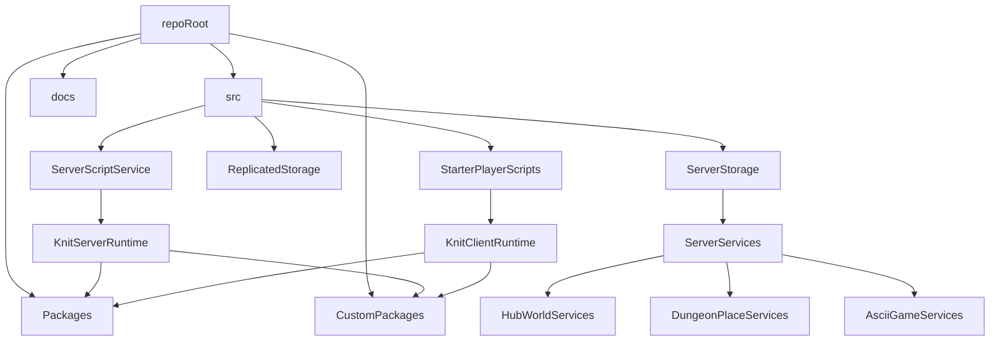

# Project structure overview

## Top-level layout

- `**src/**`: Main Roblox place source, mirroring core services (`ReplicatedStorage`, `ServerScriptService`, `ServerStorage`, `StarterPlayerScripts`).
- `**CustomPackages/**`: In-house reusable modules (behavior trees, custom camera, FastCast, Fusion root, graph utilities, particles, profile service wrapper, quests, Replica, splines, teleport queue, zones, etc.).
- `**Packages/**`: Wally-managed third-party libraries and their thin entry modules (e.g. `Knit.lua`, `Signal.lua`, `Trove.lua`, `Input.lua`, `promise.lua`) plus `_Index/` with the actual package trees.
- `**docs/**`: LDoc-generated API documentation (`index.html`, `ldoc.css`, `classes/`, `modules/`).
- `**Python/**`: Python utilities or tooling (not yet inspected in detail).
- **Root configs**: `default.project.json` (Rojo project), `wally.toml`/`wally.lock` (package management), `aftman.toml` (toolchain), `selene.toml` (lint), `package.json`/`package-lock.json` (Node tooling), `config.ld` (LDoc), `README.md`.

## Runtime Roblox source (`src/`)

- `**src/ServerScriptService/`**: Contains `KnitServerRuntime.server.lua`, which likely bootstraps server-side Knit services using the packages from `Packages/` and `CustomPackages/`.
- `**src/StarterPlayerScripts/`**: Contains `KnitClientRuntime.client.lua` (Knit client bootstrap) and `ClientControllers/` subfolder with client-side controllers (e.g. `HubWorldControllers`, `Items`, `Vehicles`).
- `**src/ReplicatedStorage/`**: Currently exposes `PatchesModule.lua`, likely shared patch/version handling between client and server.
- `**src/ServerStorage/ServerServices/**`: Grouped game-mode/service folders (`AsciiGameServices`, `DungeonPlaceServices`, `HubWorldServices`, `NewGameServices`, `WheresTungTungServices`) that encapsulate server-only logic for different experiences.

## Custom and third-party modules

### Custom packages and their use cases

- `**CustomPackages/BehaviorTree**`: Use for AI-like decision making or rule-based behavior (enemy logic, NPC routines, scripted boss phases).
- `**CustomPackages/CustomCamera**`: Use for non-default camera modes (over-the-shoulder, fixed camera, cinematic paths, special zoom rules).
- `**CustomPackages/FastCastFolder**`: Use for projectile simulation (bullets, spells, thrown items) with continuous collision detection.
- `**CustomPackages/FusionRoot**`: Use for reactive UI or stateful client components that should auto-update as state changes.
- `**CustomPackages/GraphModules**` (e.g. `PlayerCalculations`): Use for weighted choices, path/graph utilities, or complex stat/score calculations.
- `**CustomPackages/Particles**`: Use for reusable VFX setups (hit effects, environment particles, ability VFX) instead of ad-hoc emitters.
- `**CustomPackages/PlayerAddedController**`: Use for logic that should run when players join/leave, especially cross-system initialization.
- `**CustomPackages/ProfileService**` wrapper: Use for persistent player data (inventories, progression, currencies) instead of custom data layers.
- `**CustomPackages/QuestLineFolder**`: Use for quests, tasks, or linear/nonlinear quest lines; extend this rather than rolling custom quest logic.
- `**CustomPackages/Replica**`: Use for replicated state models (player stats, inventory, world state) that auto-sync to clients.
- `**CustomPackages/Splines**` (e.g. `CatmullRomSpline.lua`): Use for smooth paths/curves (camera paths, moving platforms, curved projectiles).
- `**CustomPackages/TeleportQueue**`: Use for server teleportation flows that need queuing, reliability, or batching.
- `**CustomPackages/ZoneRoot**`: Use for area/zone detection (triggers, region-based buffs, safe zones, dungeon entrances).

### Wally `Packages/` modules and their use cases

- `**Packages/Knit.lua**`: Use for all new services (server) and controllers (client); core architectural pattern for gameplay systems.
- `**Packages/Signal.lua**`: Use for fast, lightweight events between modules instead of plain `BindableEvent`s.
- `**Packages/Trove.lua**`: Use when a system creates many temporary connections/instances that must be cleaned up together (per-player or per-session).
- `**Packages/Input.lua**`: Use for robust input handling (keybinds, gamepad, mobile) via a centralized input abstraction.
- `**Packages/promise.lua**`: Use for async flows (data loads, HTTP, delayed sequences) that benefit from chaining and error handling.
- `**Packages/timer.lua**`: Use for repeated or delayed tasks with more control than `delay()`/`task.wait()`.
- `**Packages/TableUtil.lua**`: Use for non-trivial table operations (copy, shuffle, merge, etc.) instead of custom helpers.
- `**Packages/Shake.lua**`: Use for camera shake or similar procedural effects.
- `**Packages/partcache.lua**`: Use for high-frequency part spawning (bullets, particles, debris) to avoid allocation overhead.

### Quenty `node_modules` and their use cases

- `**node_modules/@quenty/signal` / `@quenty/rxsignal` / `@quenty/rx**`: Use for reactive patterns or composable event streams (deriving state from multiple sources over time).
- `**node_modules/@quenty/promise**`: Use when Quenty ecosystem code expects its own promise type or you need its specific operators.
- `**node_modules/@quenty/remoting**`: Use for structured remote APIs (request/response, reliable events) instead of raw `RemoteEvent`/`RemoteFunction`.
- `**node_modules/@quenty/timesyncservice**`: Use for client-server time synchronization (lag compensation, server-authoritative timestamps).
- `**node_modules/@quenty/valueobject` / `valuebaseutils` / `instanceutils**`: Use for observable values and clean instance utilities instead of one-off wrappers.

## High-level architecture sketch

## Next steps

- **Deep-dive option 1**: Map out specific Knit services/controllers per world (e.g. HubWorld vs Dungeon) and how they use `CustomPackages/` modules.
- **Deep-dive option 2**: Document key shared systems (Replica, ProfileService integration, quests, zones) and their extension points for new features.
- **Deep-dive option 3**: Connect this filesystem layout back to the Roblox Studio DataModel hierarchy using `default.project.json` as the source of truth.

