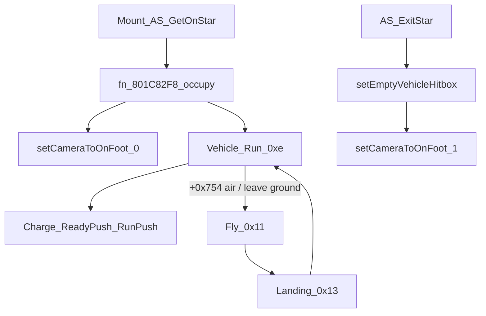

# Machine Mount, States, Stats, Air & Camera Map

Companion to [MachineRiderMovementMap.md](MachineRiderMovementMap.md). Covers board/exit, Star AS transitions, stats `+0x650`, ground/air flags, charge/boost timing, and camera subject bind — what you need next for a remake.

Sources: [`main.c`](../main.c), [`symbols.txt`](../symbols.txt).



---

## 1. Mount / dismount / occupancy

### Link fields

| Field | Meaning |
|-------|---------|
| `rider+0x3f4` | **Active** vehicle GObj (`0` = on foot) |
| `rider+0x3f8` | **Pending** vehicle during mount |
| `vehicle+0x4` | Active rider GObj |
| `vehicle+0x8` | Pending rider GObj |
| `vehicle+0x660` | Rider controller block (`**(+0x660)`: `1`=occupied, `2`=empty) |
| `vehicle+0x844` | Radar/flag slot for `fn_setOnVehicleValue` |

`fn_80191680`: mounted iff `rider+0x3f4 != 0`.

### Occupancy API

**`fn_setOnVehicleValue(vehicle, value)`** (`0x801DD2FC`, ~315642)

| Value | Meaning |
|-------|---------|
| `5` | Empty |
| `0..N` | Player port |

**`fn_801C82F8`** — occupy: commit `vc+4 = vc+8`, hitbox reinit, `setOnVehicleValue(port)`, `**(+0x660)=1`, link rider model.

**`fn_setEmptyVehicleHitbox`** (`0x801C8384`, ~301299) — park: clear `vc+4/+8`, empty hitbox, `setOnVehicleValue(5)`, `**(+0x660)=2`, clear stick floats, refresh top speed.

### Board flows

**City Trial pickup**

```text
fn_8019EF24 (proximity scan)
  → can-board gates (vc+8==0, empty)
  → fn_AS_GetOnStar (rider AS 0x73)
       pending: rider+0x3f8, vc+8
  → anim end → fn_801A8BD0
       commit +0x3f8 → +0x3f4
       fn_801C82F8 (occupy)
       setCameraToOnFoot(rider, 0)
```

**Spawn already mounted** (Air Ride etc.): `fn_80193900` → `vcInitObject` → pending → commit → `fn_801C82F8` (no GetOn AS).

### Exit flow

```text
fn_enableKirbyToExitVehicle  →  fn_getTrialFlag() != 0   // City Trial only by default
fn_checkIfGettingOffBike     →  gates + fn_AS_ExitStar (AS 0x6e)
fn_80193F98 dismount core:
  setCameraToOnFoot(1)
  → setEmptyVehicleHitbox
  → clear player↔machine binding
  → fn_getOffBike_giveUpwardMomemtum  // rider vel up (0,1,0) impulse
  → rider+0x3f4/+0x3f8 = 0
```

Always-on modes: trial flag false → manual exit blocked unless machine `+0xc35` bit3.

---

## 2. Star vehicle action states

`fn_chargeLogic_(…, vehicle, stateId, …)` → `vehicle+0x30 = stateId`; table row `(stateId - 8)` from Star callback table.

| ID | Name | Enter |
|----|------|-------|
| `0x8` | WaitStop | `fn_801EE710` |
| `0x9` | WaitRun | `fn_801EE84C` |
| `0xa` | WaitFly | `fn_801EEA10` |
| `0xb` | Adhere | `fn_801EEB98` |
| `0xc` | Ready | `fn_801EEC68` |
| `0xd` | ReadyPush | `fn_801EEDB0` |
| `0xe` | **Run** | `fn_801EEF30` |
| `0xf` | **RunPush** | `fn_801EF278` |
| `0x10` | RunPushForward | `fn_801EF564` |
| `0x11` | **Fly** | `fn_801EF848` / `EF8A4` / `EF908` |
| `0x12` | **FlyPush** | `fn_801EFBB0` / `EFC20` |
| `0x13` | **Landing** | `fn_801EFE10` |
| `0x14` | Drop | `fn_801F0098` |
| `0x15` | SuperJump | `fn_801F02F4` |
| `0x16`–`0x1a` | Rail / Gondola / Cannon | … |
| `0x1b`–`0x1d` | FallDeath / Rebirth / BreakDown | … |

### Ground ↔ air transitions (`_4`)

| From | Condition | To |
|------|-----------|-----|
| Run | leave ground (`fn_801EF7D4` / ray `stats+0x15c`) | Fly |
| RunPush | leave ground (`fn_801EFB20`) | FlyPush |
| Fly | ground contact (`fn_801E3E48`) | Run |
| Fly | air land flag (`+0xc30` bit5) via `fn_801EFDD8` | Landing |
| FlyPush | ground | RunPush |
| FlyPush | land flag | Landing |
| Landing | still no floor (`fn_801CF1B8`) | Fly |
| Landing `_1` | abort flag | Run |

**Air flag:** `vehicle+0x754` — `1` = air, `0` = ground  
Set air: `fn_801C9DB8` / `fn_801CA00C`  
Set ground: `fn_801C992C` / `fn_801C9B7C`

---

## 3. Rider charge / glide / land AS

| Rider enter | AS ID | When |
|-------------|-------|------|
| `fn_startCharge` | → `0x5e` path | Charge bit; first gate in ground/air Control |
| `fn_AS_StarBeginCharge` | `0x28` | Charge held → begin anim |
| `fn_AS_StarChargeHold` | `0x29` | Hold |
| `fn_AS_StarChargeRelease` | `0x2a` | Release (ground boost path) |
| `fn_AS_StarChargeRelease2/3` | `0x24` / `0x25` | Air release paths |
| `fn_AS_StarGlide` | `0x23` | `vehicle+0x754 == 1` |
| `fn_AS_StarLandOK` | `0x69` | Land quality OK (`+0xc33` bit6) |
| `fn_AS_StarLandGreat` | `0x6a` | Great (bit5) |
| `fn_AS_StarLandBad` | `0x6b` | Bad (bit4) |

**Control shells**

| | Ground | Air |
|--|--------|-----|
| Stick | `fn_groundMovement` | `fn_8019FCF0` |
| Then | charge → charge anim → spin → **quick spin** | charge → charge anim → spin (**no** quick spin) |

Vehicle side while charging: `_2` gates (`charge_whileGroundedCheck` / MidAir) → `chargeLogic_` into ReadyPush / RunPush / FlyPush; `_3` uses `fn_801ED3A8(±stats+0xd0)` for scrub/boost energy.

---

## 4. Stats blob (`vehicle+0x650`)

| stats+ | Meaning | Used by |
|--------|---------|---------|
| `+0x1c` | Top speed | `accelerateStar` |
| `+0x38` | Min opposing-dot for lift | Fly `EBE88` |
| `+0xac` | Initial hover energy | seeds vehicle `+900` and cap `+0x388` |
| `+0xb8` / `+0xbc` | Ground turn rate base / high | `fn_801EC5CC` |
| `+0xc8` | Turn angle threshold (deg) | `EC5CC` |
| `+0xcc` | Extra turn past threshold | `EC5CC` |
| `+0xd0` | Charge/boost hover delta | `fn_801ED3A8` (often negated while charging) |
| `+0xd4` | Cruise hover delta | `fn_801ED43C` |
| `+0x118`…`+0x128` | Air-turn curves | `EC5CC` air path |
| `+0x13c`…`+0x150` | Pitch lean scale / rates / clamps | `fn_801EC118` |
| `+0x15c` | Ground-leave / land ray length | `fn_801CF1B8` / `EF7A4` |
| `+0x160` | Fly blend duration | Fly enter + `Fly_3` |
| `+0x170` / `+0x174` | Flight force / air-time decay | `EBE88` / `EBF84` |

**Runtime hover (on vehicle, not stats ptr)**

| Field | Role |
|-------|------|
| `+900` | Current hover energy |
| `+0x388` | Cap |
| `+0x6fc` | Probe offset `= -(+900)` |

`fn_801ED3A8(delta)`: adjust `+900`, clamp, write axial contrib `+0x330…`, update `+0x6fc`.

Steer rate tables used by `fn_801D9264` live as **copied vehicle fields** (`+0x548…+0x560`), not live `+0x650` reads each frame.

---

## 5. Air / Fly / Landing physics notes

**`Star_Fly_3`** (~328354): flight physics tick — blend timer `+0x1b40` vs `stats+0x160` → `fn_801EBE88` on `+0x43c/+0x448` → air helpers → `accelerateStar`.

**`Star_Landing_3`**: grounded-style helper chain (drag/tilt/accel) while Landing AS.

**`Star_Landing_4`**: floor probe with `stats+0x15c`; miss → back to Fly; hit → settle.

Rider air think (~279142): try LandOK → LandGreat → LandBad → else if air flag continue glide path.

---

## 6. Camera subject bind & chase

### Bind

```text
rider create → subject at rider+0x450 (0xE8 block)
camera+0x94 = that subject (per player slot)
mount:  setCameraToOnFoot(rider, 0)  → subject+0xa9 bit1 = riding
dismount: setCameraToOnFoot(rider, 1) → on-foot
```

**Fill subject each frame**

| Mode | Filler | Source |
|------|--------|--------|
| On foot | `fn_80192DB8` | rider pos/facing/basis |
| On machine | `fn_80193004` | vehicle via `rider+0x3f4` (`fn_801C7E60`…); air flag from `vehicle+0x754` |

### Chase pipeline

```text
mode vtable (StructWithFuncPtrs_40 @ 0x804A1F0C)
  → fn_800B61F4   // place eye/interest vs subject
  → fn_800B2540   // smooth look; wall-aware; snap if ≥1600
  → fn_800B0CDC   // blend modes into live eye/interest/FOV
  → fn_800B3540   // HSD_CObjSetInterest / Eye / Fov
```

**CStick:** `fn_cameraControl` → `fn_cameraControlThink` — deadzone 0.4, yaw/pitch from `DAT_8055747c` (`+0x32c/+0x330/+0x334`, clamps `+0x340…`).

### Important cam params (`DAT_8055747c` / `cmMainParamCommon`)

| Offset | Use |
|--------|-----|
| `+0x00…+0x0C` | Base chase distances |
| `+0x14/+0x18/+0x1C` | Distance by split-screen count |
| `+0x20/+0x24` | Height → pull-back |
| `+0x32C/+0x330/+0x334` | Stick pitch / yaw gain / yaw max |
| `+0x338/+0x33C` | Chase yaw blend |
| `+0x488/+0x48C` | Default FOV / Y bias |

Camera follows the **subject**, not vehicle accel helpers directly.

---

## 7. Remake checklist (this pass)

| Feature | Original hook | Lua remake note |
|---------|---------------|-----------------|
| Mount | pending → commit → occupy | Weld/sit; set “driving”; cam ride mode |
| Dismount | Trial-gated ExitStar + upward impulse | Optional gate; unsit + hop |
| Occupancy | port vs `5` empty | Owner UserId / nil |
| Ground/air | `+0x754` + leave/land probes | Ray/shapecast; set Airborne bool |
| Run↔Fly↔Land | `_4` table above | State machine with same edges |
| Charge→boost | rider AS 0x28–0x2a + vehicle RunPush | Hold scrub (`+0xd0`), release boost |
| Stats | table above | `MachineStats` ModuleScript |
| Camera | subject bind + chase params | Attach CameraSubject / custom chase; CStick orbit |

---

## Quick address index

| Addr | Symbol | Layer |
|------|--------|-------|
| `0x801DD2FC` | `fn_setOnVehicleValue` | Occupancy |
| `0x801C8384` | `fn_setEmptyVehicleHitbox` | Dismount |
| `0x801C82F8` | occupy | Mount |
| `0x801BA054` | `fn_AS_GetOnStar` | Mount AS |
| `0x801B9DF8` | `fn_AS_ExitStar` | Exit AS |
| `0x801918D0` | `fn_enableKirbyToExitVehicle` | Trial gate |
| `0x801B9D6C` | `fn_checkIfGettingOffBike` | Exit poll |
| `0x801A2EB4` | `fn_getOffBike_giveUpwardMomemtum` | Exit hop |
| `0x801934DC` | `fn_setCameraToOnFoot` | Cam mode |
| `0x80193004` | machine→subject fill | Cam |
| `0x800B61F4` / `2540` / `0CDC` / `3540` | Chase pipeline | Cam |
| `0x800B67CC` | `fn_cameraControlThink` | CStick |
| `0x801EEF30` / `EF278` / `EF848` / `EFE10` | Run / RunPush / Fly / Landing enter | AS |
| `0x801B2C4C` | `fn_startCharge` | Charge |
| `0x801ABFF4` | `fn_AS_StarGlide` | Air rider |
| `0x801ACA44` / `ACC60` / `ACE40` | Land OK/Great/Bad | Land |

Still open for later: exact numeric defaults inside each machine’s `.dat` stats, Wheel-only Jump graph, PvP knockback magnitudes, rail/gondola.
