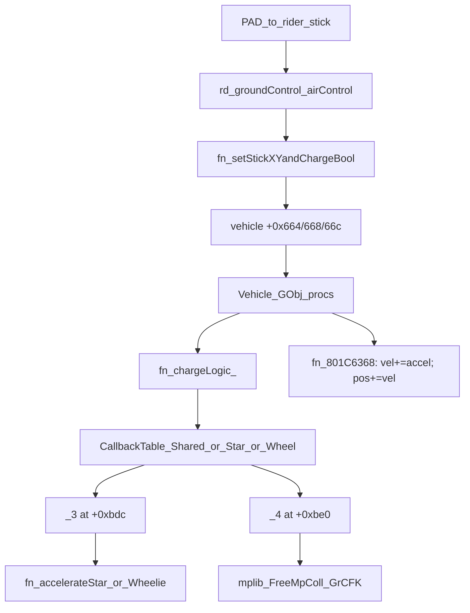

# Original Machine / Rider Movement Implementation Map

Reading map of how Kirby Air Ride implements machine + rider movement on the NA GhidraCCode branch. Sources: [`main.c`](../main.c), [`symbols.txt`](../symbols.txt).

Companion (mount/exit, AS graph, stats, air/land, camera): [MachineMountCameraAndStates.md](MachineMountCameraAndStates.md).

Prefixes: **`vc`** = vehicle/machine, **`rd`** = rider (Kirby on machine), **`pl`** = player slot.



---

## 1. Object model (`vc` init)

### Create path

| Step | Symbol | Addr | `main.c` |
|------|--------|------|----------|
| Create GObj kind `0x10` | `fn_vcInitObject` | `0x801C552C` | ~298959 |
| Zero userdata `0x1bc0`, wire tables | `fn_801C4F98` | — | ~298731 |
| Load `Vc*.dat` | `fn_vcLoadVehicleArchive` | `0x801C6D74` | ~299814 |
| Change action state | `fn_chargeLogic_` | `0x801C59A4` | ~299078 |

`fn_vcInitObject`:

1. `fn_GObj_Create(0x10, …)` + GX link + `fn_HSD_ObjAlloc` userdata
2. `fn_vcLoadVehicleArchive` then `fn_801C4F98` (init blob)
3. Load joint model, run many one-shot inits (hitbox, stats, pose…)
4. Register per-frame procs via `fn_804288A4`
5. Finish with `fn_GetTopGroundSpeedAndModifyIt` and related setup

### Userdata field map (vehicle blob)

Offsets are byte offsets into the userdata pointed by GObj `+0x2c`.

| Offset | Role |
|--------|------|
| `+0x0` | Back-pointer to GObj |
| `+0x10` | Machine kind index (indexes `lbl_805D6F98` vtable) |
| `+0x30` | Current main action state ID |
| `+0x34` | Ptr → `Struct_Vehicles_CallbackTable_Shared` (states `< 8`) |
| `+0x38` | Ptr → kind table (Star/Wheel; states `>= 8`) |
| `+0x318 / +0x31c / +800` | Accel XYZ |
| `+0x324 / +0x328 / +0x32c` | Velocity XYZ |
| `+1000 / +0x3ec / +0x3f0` | Position / integrated XYZ (Ghidra decimal `1000` = `0x3e8`) |
| `+0x330…` / `+0x3a8…` / `+0x3c8…` | Extra velocity contributions added in integrator |
| `+0x650` | Stats pointer (top speed at stats`+0x1c`, boost at `+0xd0`, fly params…) |
| `+0x660` | **Rider** pointer (`rd` block) |
| `+0x664` | Stick X (fed by rider) |
| `+0x668` | Stick Y |
| `+0x66c` | Charge bool |
| `+0x670 / +0x671` | Stick-Y hold counters (up/down) |
| `+0x700` | mplib / course-coll context |
| `+0xbd4` | Live callback `_1` |
| `+0xbd8` | Live callback `_2` |
| `+0xbdc` | Live callback `_3` (physics) |
| `+0xbe0` | Live callback `_4` (post) |
| `+0xbec / +0xbf0 / +0xbf4` | Sub-state callbacks (from `fn_801C5DD4`) |
| `+0xc30…+0xc3c` | Flag bytes cleared/set on AS change |

From `fn_801C4F98` (~298751):

- `__s[0xd]` (`+0x34`) = `Struct_Vehicles_CallbackTable_Shared`
- `__s[0xe]` (`+0x38`) = `*(lbl_805D6F98[kind])` — Star or Wheel callback base

Blob size: `memset(..., 0, 0x1bc0)`.

### Per-frame proc order (registered in `vcInitObject`)

| Priority | Proc | Role |
|----------|------|------|
| 0 | `fn_801C5FE0` | Timers, clear frame flags, optional `+0xbf8`, kind hook `+0x2c` |
| 1 | `fn_801C618C` | Anim/update; calls `+0xbec` then **`+0xbd4` (_1)** |
| 3 | `fn_801C628C` | Stick-Y hold counters; calls `+0xbf0` then **`+0xbd8` (_2)** |
| 4 | `fn_801C6368` | Calls `+0xbf4` then **`+0xbdc` (_3 physics)**; then **integrates** vel→pos |
| 5 | `fn_801C65A8` | Calls **`+0xbe0` (_4 post)**; fall-death / rail helpers |
| 6 | `fn_801C6668` | Optional `+0xbe4` |
| 7 | `fn_801C66D0` | Rider sync, **`fn_setHeadOnHitBox_`**, pose |
| 9 | `fn_801C67A0` | Later phase |
| 10 | `fn_givePlayerDamage` | Damage |
| 0x15 | `fn_801C69F0` | Late phase |

### Rider ↔ vehicle link

- Vehicle `+0x660` → rider userdata
- Rider `+0x3f4` → vehicle GObj (passed into `fn_setStickXYandChargeBool`)
- AS change may call into rider via `fn_8018C668(vehicle+0x660)` when flags allow
- Empty/parked machine: `fn_setEmptyVehicleHitbox` nulls occupancy and sets rider GObj kind field to empty (`**(rd)=2`)

---

## 2. Input path (`rd` → `vc`)

### Stick + charge feed

| Symbol | Addr | `main.c` | Role |
|--------|------|----------|------|
| `fn_groundMovement` | `0x80190C54` | ~258552 | Deadzone/scale rider stick → vehicle |
| `fn_setStickXYandChargeBool` | `0x801C75F4` | ~300219 | Write `+0x664/668/66c` |
| `fn_groundControl` | `0x801AB300` | ~278439 | Ground control shell |
| `fn_airControl` | `0x801AC128` | ~279108 | Air control shell |
| `fn_startCharge` | — | — | Begin charge AS |
| `fn_ground_chargeAnimation` | — | — | Charge hold anim path |
| `fn_ground_Spin` / `fn_doQuickSpin` | — | — | Spin only if charge did not consume input |

### `fn_groundMovement` behavior

1. Read rider `+0x394` (stick X), `+0x398` (stick Y)
2. Deadzone / rescale using globals at `STRUCT_BYTE4_COUNT_1805DD814` (and curve helper `fn_80062C4C`)
3. Call:

```text
fn_setStickXYandChargeBool(
  scaledStickY,           // → vehicle +0x668
  scaledStickX,           // → vehicle +0x664
  rider[+0x3f4],          // vehicle GObj
  (rider[+0x3d8] >> 8) & 1  // charge bit → +0x66c
)
```

`fn_setStickXYandChargeBool` resolves userdata via `gobj+0x2c` and stores the three fields.

### Control priority

**Ground** (`fn_groundControl`):

```text
groundMovement
→ startCharge
→ else ground_chargeAnimation
→ else ground_Spin → groundSpin2_ → doQuickSpin
```

**Air** (`fn_airControl`):

```text
fn_8019FCF0 (air stick feed analogue)
→ startCharge
→ else ground_chargeAnimation
→ else ground_Spin → groundSpin2_
```

Charge wins over spin. Stick is always pushed to the vehicle first.

### Vehicle-side charge gates (read `+0x66c`)

| Symbol | Role |
|--------|------|
| `fn_charge_whileGroundedCheck` | If charging on ground → force AS (via `fn_801DD17C` / follow-ups) |
| `fn_charge_whileMidAirCheck` | Same for air |
| `fn_charge_whileGroundedChargingCheck` / grinding variants | Specialized rails/charge |

Example: `Star_Run_2` is literally `fn_charge_whileGroundedCheck()` (~327906).

---

## 3. Action-state machine

### Change function: `fn_chargeLogic_`

`fn_chargeLogic_(animRate, …, vehicle, stateId, animIdOr-1, flags)` (~299078):

1. Write `vehicle+0x30 = stateId`
2. Clear many `+0xc3x` flags (unless `flags` bits preserve them)
3. Optionally sync/clear rider attachments (`+0x660`)
4. Select table row:
   - `stateId < 8` → `vehicle+0x34` + `stateId * 0x18` (**Shared**)
   - else → `vehicle+0x38` + `(stateId - 8) * 0x18` (**Star or Wheel**)
5. Install live callbacks from row (`int[6]`, stride `0x18`):

| Row word | Installed at | Invoked by | Decomp name |
|----------|--------------|------------|-------------|
| `[0]` | anim select | enter | anim / motion ID |
| `[1]` | `+0xbcc` | — | aux |
| `[2]` | `+0xbd4` | `fn_801C618C` | `_1` |
| `[3]` | `+0xbd8` | `fn_801C628C` | `_2` |
| `[4]` | `+0xbdc` | `fn_801C6368` | `_3` physics |
| `[5]` | `+0xbe0` | `fn_801C65A8` | `_4` post |

Sub-state changer `fn_801C5DD4` installs a parallel set at `+0xbec/+0xbf0/+0xbf4` (and related).

### Data tables

| Symbol | Addr | Size | Use |
|--------|------|------|-----|
| `Struct_Vehicles_CallbackTable_Shared` | `0x804B0830` | `0xC0` | States 0–7 |
| `Struct_Vehicles_CallbackTable_Stars` | `0x804B0FB8` | `0x2D0` | Star family ≥ 8 |
| `Struct_Vehicles_CallbackTable_Wheel` | `0x804B1798` | `0x360` | Wheel family ≥ 8 |

### Star states (named callbacks)

| State | Notes |
|-------|-------|
| WaitStop / WaitRun / WaitFly | Idle variants |
| Adhere | Stick-to-surface |
| Ready / ReadyPush | Pre-boost |
| **Run** | Ground cruise; `_3` = `HandlePhysicsGround` |
| **RunPush** | Boost; `_3` = `HandleBoostPhysics` |
| RunPushForward | Forward-boost variant (state id `0x10` from `fn_801EF564`) |
| **Fly** | Air; `_3` = `HandleFlightPhysics` |
| FlyPush | Air boost |
| Landing / Drop / BreakDown | Land / fallout |
| SuperJump / FallDeath / Rebirth | Special |
| RailRun / RailRunPush / RailChange | Grind rails |
| Gondola / Cannon | Stage gizmos |

Known `chargeLogic_` state IDs from callers:

- `0xe` — enter Run (`fn_801EEF30`)
- `0x10` — RunPushForward (`fn_801EF564`)
- `0x12` — FlyPush from mid-air charge (`fn_801EFBB0`)

### Wheel states (named callbacks)

Same pattern; differences:

- **WaitJump** instead of WaitFly / Fly family emphasis
- ReadyPush**Start/End**, RunPush**Start/End**, RailRunPush**Start/End**
- Ground `_3`: `Wheel_Run_3` → ends in `fn_accelerateWheelie`
- No separate named `HandlePhysicsGround` / `HandleFlightPhysics` symbols (logic in unnamed `fn_801F*` helpers)

---

## 4. Physics pipelines (`_3` + accel + integrate)

### Important split

1. **`_3` callback** builds / adjusts **accel** (`+0x318…`) and may call `fn_accelerateStar` to **clamp** pending accel against top speed.
2. **`fn_801C6368`** (after `_3`) does the real integration:

```text
vel  += accel          // +0x324 += +0x318 (and Y/Z)
pos  += vel            // +0x3e8/+0x3ec/+0x3f0 += vel
pos  += extra contribs // +0x330…, +0x3a8…, +0x3c8…, etc.
```

Unless flag `+0xc33` bit1 is set (rail/path mode → `fn_801E4960` path).

### `fn_accelerateStar` (`0x801EC074`, ~325581)

```text
proposedVel = vel(+0x324) + accel(+0x318)
if fn_isAccelerationPossible(stats[+0x1c], &proposedVel):
  accel = proposedVel - vel   // keep only the allowed delta
```

Does **not** write velocity itself. Wheel twin: `fn_accelerateWheelie` (`0x801F78F8`, ~333566).

### Star Run `_3` — ground (`0x801EEFA0`, ~327915)

Call order:

```text
fn_801D8388
fn_801EBFF0
fn_801D9264
fn_801EC114          (empty stub)
fn_801ED330
fn_801ED43C
fn_801EC5CC
fn_801DA6A8
fn_801EC78C
fn_801EC7DC
fn_801ECAE4
fn_801ECD00
fn_801ECD74
fn_801ECDA8
fn_801ECE70
fn_801ECF20
fn_801ED2BC
fn_accelerateStar
fn_801ED74C
fn_801ED748
fn_801EC118          // orientation / tilt from stats +0x13c…+0x150
fn_801EC254
fn_801EDC74
```

### Star RunPush `_3` — boost (`0x801EF364`, ~328091)

```text
fn_801D85C0
fn_801EBFF0
fn_801D9264
fn_801ED330
fn_801ED3A8(±stats[+0xd0])   // boost accel from stats; sign from flag +0xc30>>6
fn_801EC5CC … fn_801ECF20    // shared mid pipeline (subset)
fn_accelerateStar
fn_801ED74C
optional fn_801CC480
fn_801EC118
fn_801EC33C
fn_801EDC74
```

### Star Fly `_3` — flight (`0x801EF9A0`, ~328354)

```text
fn_801EBC90
blend = f(machine+0x1b40, stats[+0x160])
fn_801EBE88(blend, …)
fn_801D98A0
fn_801D9C38
fn_801D9064
fn_801DA6A8
fn_801ED4D8
fn_801ECD74
fn_801ECDA8
fn_801D8F7C
fn_accelerateStar
fn_801CA334(machine[+0x5c0])
```

### Wheel Run `_3` (`0x801F94C4`, ~334918)

```text
fn_801D8388
fn_801F6254 … fn_801F77E0   // wheel-specific helpers
fn_accelerateWheelie
fn_801F7E54
fn_801DA894
```

### Stats / top speed

| Symbol | Role |
|--------|------|
| `fn_GetTopGroundSpeedAndModifyIt` | Copies/mods speed-related block; respects `+0xa18/+0xa1c` overrides |
| `vehicle+0x650` | Stats base used by accel / boost / fly / tilt |
| `fn_isAccelerationPossible` (`0x800640B8`) | Top-speed gate used by `accelerateStar` |

### Post `_4` examples (transition + coll)

**Star Run `_4`** (~327946): helpers then **`fn_801CDF84`** (course coll), then transition checks.

**Star Fly `_4`** (~328384): **`fn_checkMachineStuck`**; if not stuck, landing / state transitions (`fn_801EFDD8` / `fn_801EEF30` → Run).

**Wheel Run `_4`**: also calls **`fn_801CDF84`**.

---

## 5. Collision

Two separate systems.

### A. Course / floor / wall (mplib)

Evidence: asserts against `mplib.h`, `cgf_allPtr_coll_info_AND_GrCFK_Wall` / Under / Top.

| Symbol / cluster | Addr / lines | Role |
|------------------|--------------|------|
| `fn_801CDC00` | `0x801CDC00`, ~305349 | Query coll using `vehicle+0x700` mplib ctx; wall/floor info |
| `fn_801CDDB0` | — | Related probe |
| `fn_801CDF00` | — | Used when stuck resolution needs contact data |
| `fn_801CDF84` | ~305476 | Heavy course-coll resolve; called from many `_4` posts |
| FreeMpColl pool | `fn_802410D4`–`fn_80241CA8` | Allocator/lookup (`NotFind_FreeMpColl_mcp`) |
| `fn_collideWithObject` | `0x800F5004` | Generic object collide |
| Curve name strings | — | `scrapeWallCurve`, `bumpGroundCurve`, `craterCollCurve` |

Vehicle stores mplib context at **`+0x700`**. Probes combine position (`+0x3e8…`) with orientation vectors (`+0x418/+0x424`).

Stage-side modifiers (not in vehicle table, but affect motion): `fn_grGetGravityposNum`, `fn_grConveyorMovement`, gravity/airflow func tables.

### B. Hitboxes / gameplay collide

| Symbol | Addr | Role |
|--------|------|------|
| `fn_setEmptyVehicleHitbox` | `0x801C8384` | Parked/empty machine; clears rider occupancy |
| `fn_setHeadOnHitBox_` | `0x801D7604` | Per-frame in `fn_801C66D0`; scales hitbox from velocity (`+0x354` direction) |
| `fn_checkMachineStuck` | `0x801D2B04` | Geometry stuck check (City Trial aware via `fn_getTrialFlag`); used from Fly/Land `_4` |
| Power-up / stat collide | `fn_collideWithStat?`, `fn_collideWithPowerUpGeneral` | Pickups, not floor |

### Do not confuse

`fn_DetectCollision` — ARP/IP networking, **not** machine physics.

---

## Address → role quick index

| Addr | Symbol | Layer |
|------|--------|-------|
| `0x80190C54` | `fn_groundMovement` | Input |
| `0x801AB300` | `fn_groundControl` | Input shell |
| `0x801AC128` | `fn_airControl` | Input shell |
| `0x801C552C` | `fn_vcInitObject` | Object |
| `0x801C59A4` | `fn_chargeLogic_` | AS change |
| `0x801C5FE0` | early tick | Proc 0 |
| `0x801C618C` | run `_1` | Proc 1 |
| `0x801C628C` | stick hold + `_2` | Proc 3 |
| `0x801C6368` | `_3` + integrate | Proc 4 |
| `0x801C65A8` | `_4` | Proc 5 |
| `0x801C66D0` | head-on hitbox | Proc 7 |
| `0x801C75F4` | `fn_setStickXYandChargeBool` | Input |
| `0x801C7278` | `fn_GetTopGroundSpeedAndModifyIt` | Stats |
| `0x801CDC00`… | mplib vehicle queries | World coll |
| `0x801CDF84` | course coll in `_4` | World coll |
| `0x801D2B04` | `fn_checkMachineStuck` | Stuck |
| `0x801D7604` | `fn_setHeadOnHitBox_` | Hitbox |
| `0x801EC074` | `fn_accelerateStar` | Physics |
| `0x801EEFA0` | Star Run `_3` | Physics |
| `0x801EF364` | Star RunPush `_3` | Physics |
| `0x801EF9A0` | Star Fly `_3` | Physics |
| `0x801F78F8` | `fn_accelerateWheelie` | Physics |
| `0x801F94C4` | Wheel Run `_3` | Physics |
| `0x804B0830` | Shared callback table | Data |
| `0x804B0FB8` | Stars callback table | Data |
| `0x804B1798` | Wheel callback table | Data |
| `0x80241xxx` | FreeMpColl | World coll |

---

## High-value still-unnamed helpers

Worth renaming when continuing decomp (called from named `_3` / coll paths):

| Helper | Seen from |
|--------|-----------|
| `fn_801D8388` | Star/Wheel Run ground start |
| `fn_801EBFF0`, `fn_801D9264` | Shared ground mid |
| `fn_801ED3A8` | Boost accel from stats |
| `fn_801EC118` | Orientation / bank |
| `fn_801EBC90`, `fn_801EBE88` | Flight setup |
| `fn_801D85C0` | Boost path start |
| `fn_801F6254`…`fn_801F77E0` | Wheel ground pipeline |
| `fn_801CDF84` | Course coll resolve (large) |

---

## End-to-end tick (original order)

```text
1. Rider think: groundControl / airControl
     → groundMovement scales stick
     → setStickXYandChargeBool writes vehicle +0x664/668/66c
     → startCharge / spin may change rider AS (and later vehicle AS)

2. Vehicle proc 0  (fn_801C5FE0): timers / flags
3. Vehicle proc 1  (fn_801C618C): callback _1
4. Vehicle proc 3  (fn_801C628C): stick-Y hold; callback _2
     → e.g. charge_whileGroundedCheck may call chargeLogic_ → new state
5. Vehicle proc 4  (fn_801C6368):
     → callback _3 builds accel (accelerateStar clamps)
     → vel += accel; pos += vel (+ extras)
6. Vehicle proc 5  (fn_801C65A8): callback _4
     → often fn_801CDF84 / checkMachineStuck / AS transitions
7. Vehicle proc 7  (fn_801C66D0): setHeadOnHitBox_, rider pose sync
```

That is the original machine/rider movement implementation structure.
