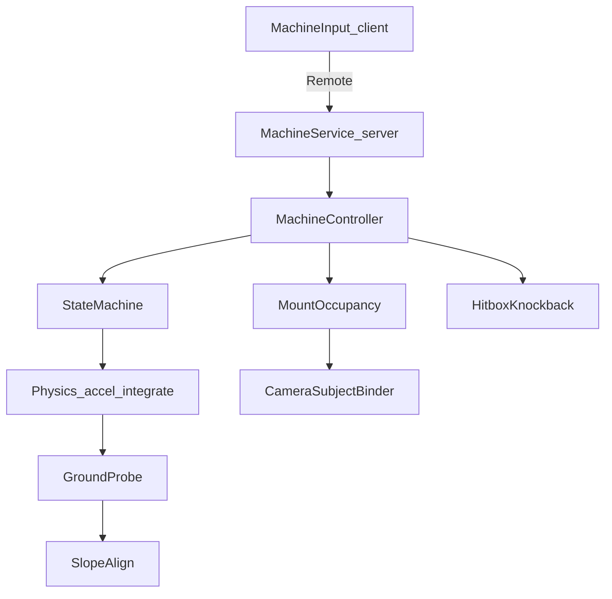

# Roblox Implementation Plan — KAR-Style Machine Drive

Remake Kirby Air Ride machine feel in Roblox Luau, using the decomp maps as behavior reference:

- [MachineRiderMovementMap.md](MachineRiderMovementMap.md)
- [MachineMountCameraAndStates.md](MachineMountCameraAndStates.md)

**Not a line-by-line port.** Match the original loop: mount → stick/charge → states → accel → integrate → ground probe → camera subject → hit impulses.

---

## Goals (v1)

Player can:

1. Mount / dismount a Warp Star–style machine  
2. Steer, charge-scrub, release-boost  
3. Leave ground → air control → land  
4. Align to slopes; stay at ride height via ground probe  
5. Chase camera (ride vs on-foot)  
6. Basic machine↔machine knockback  

**Out of v1:** Wheelie Jump graph, rails/gondola/cannon, City Trial spawners, full damage%, exact `.dat` numbers (tune by feel).

---

## Architecture (mirrors `rd` / `vc`)



### Module layout

```text
ReplicatedStorage/MachineSystem/
  MachineStats.lua          -- tunables (from +0x650 meanings)
  MachineStates.lua         -- Idle, Run, Charge, Boost, Fly, Land
  MachineTypes.lua          -- shared enums / attrs
  GroundProbe.lua           -- pos + up * hoverOffset; ray/shapecast
  Physics.lua               -- accel build, top-speed clamp, integrate
  StateMachine.lua          -- transition table (Run↔Fly↔Land↔Charge↔Boost)
  HitboxKnockback.lua       -- speed-gated hitbox + impulse
  CameraChase.lua           -- client chase (subject bind)
  Mount.lua                 -- weld/sit, occupancy

ServerScriptService/
  MachineService.lua        -- spawn, mount validate, Heartbeat Step

StarterPlayerScripts/
  MachineClient.lua         -- input → UnreliableRemoteEvent
  MachineCameraClient.lua   -- ride/on-foot camera
```

### Authority (chosen default)

- **Server** owns machine Assembly velocity, state, mount/dismount, knockback  
- **Client** sends `{Steer, Forward, ChargeHeld}` each frame (UnreliableRemoteEvent)  
- **Client** runs camera chase locally from machine CFrame (smooth)  
- Optional later: client predict + reconcile  

Do **not** use default `VehicleSeat` throttle/steer physics.

---

## Data model

### Machine model (Workspace)

- `Model` with `PrimaryPart` = drive root (Anchored false, Massless parts welded)  
- Attach: `RiderAttach` Attachment / seat part  
- Attributes or Config folder: `MachineId`, `OwnerUserId` (nil = empty)  
- Collision: root collides with world; rider character non-collide with machine while mounted  

### `MachineStats` (ModuleScript — start with Warp Star placeholders)

| Field | KAR source | Role |
|-------|------------|------|
| `TopSpeed` | stats`+0x1c` | Accel clamp |
| `TurnRateGround` / `TurnRateHigh` | `+0xb8/+0xbc` | Yaw |
| `TurnThresholdDeg` / `TurnExtra` | `+0xc8/+0xcc` | Turn curve |
| `AirTurn*` | `+0x118…+0x128` | Air yaw |
| `ChargeHoverDelta` | `+0xd0` | Charge scrub (negative) |
| `CruiseHoverDelta` | `+0xd4` | Coast hover |
| `HoverEnergyMax` | seeds `+0x388` | Cap for hover energy |
| `HoverProbeScale` | → `+0x6fc` | Ride height |
| `LeaveGroundRayLength` | `+0x15c` | Airborne test |
| `FlyBlendTime` | `+0x160` | Enter-fly settle |
| `Pitch*` | `+0x13c…+0x150` | Slope/stick pitch |
| `KbMultiplier` | `+0x498` | Knockback scale |
| `HeadOnSpeedMin` / `HeadOnSizeScale` | head-on hitbox | Enable PvP hit |

### Runtime state (server Module or attributes)

```text
State: Idle|Run|Charge|Boost|Fly|Land
StickX, StickY, Charging
Velocity (Vector3)
Accel (Vector3)
HoverEnergy
Grounded (bool)           -- KAR +0x754 inverted (Grounded = +0x754==0)
Facing, Up, Right         -- orientation basis
Owner: Player?
BoostTimer / Charge01
```

---

## Phase plan

### Phase 0 — Project scaffold

1. Create folder structure + empty ModuleScripts  
2. Place a star `Model` with PrimaryPart + RiderAttach  
3. `MachineService` spawns one machine; tags with CollectionService `"AirRideMachine"`  

### Phase 1 — Mount / dismount / occupancy

Mirror: pending → commit → occupy / empty value `5`.

| Step | Behavior |
|------|----------|
| Interact (ProximityPrompt) | If empty → mount |
| Mount | Weld character to RiderAttach; `Humanoid.PlatformStand` or Sit; `WalkSpeed=0`; set `OwnerUserId`; state `Run` or `Idle` |
| Cam | Fire client: ride mode |
| Dismount | Prompt or key (always allowed in v1, or gate like Trial); unweld; upward impulse; clear owner; cam on-foot |

Server validates owner on every input packet.

### Phase 2 — Core physics loop (Run only)

Each `Heartbeat` / `Stepped` on server for occupied machines:

```text
1. Read latest input (StickX/Y, ChargeHeld)
2. StateMachine:Evaluate transitions
3. Physics:ComputeAccel(state, input, stats, dt)
4. Clamp: proposed = vel + accel; if |proposed| > TopSpeed then shrink accel
5. vel += accel; pos via AssemblyLinearVelocity = vel
6. GroundProbe + SlopeAlign
7. HitboxKnockback:Step
```

**Ground probe (KAR approximation)**

```text
probePos = root.Position + up * (-HoverEnergy)  -- or fixed RideHeight
ray down / shapecast along -up
if hit within LeaveGroundRayLength:
  Grounded = true
  snap/slide: project vel onto plane; Up = Normal (smoothed)
else:
  Grounded = false → request Fly
```

**Orientation:** rebuild basis like `fn_801C8F84` (Up = normal, Forward re-orthogonalized); `AlignOrientation` or set CFrame yaw/pitch gradually with Pitch* rates.

**Turning:** yaw rate from StickX (`D9264`/`EC5CC` feel): `Facing = rotate around Up by turnRate * StickX * dt`.

### Phase 3 — Charge / brake / boost

| State | Enter | Physics | Exit |
|-------|-------|---------|------|
| `Charge` | ChargeHeld while Grounded | Apply negative `ChargeHoverDelta` / damp horizontal speed | Release → `Boost` |
| `Boost` | Charge release | Strong forward accel for `BoostDuration`; raise TopSpeed briefly | Timer end → `Run` or `Fly` |
| Coast | Run no charge | Small `CruiseHoverDelta` / drag | — |

Client UI: charge bar 0–1 while holding (optional).

### Phase 4 — Air / land

| Transition | Condition |
|------------|-----------|
| Run/Boost → Fly | `not Grounded` |
| Fly → Land | Ground contact + downward/land flag |
| Land → Run | Settled on ground |
| Fly → Run | Soft touch (optional shortcut) |

**Fly physics:** reduced gravity (custom: add upward cancel or lower workspace gravity on machine only via counter-force), air turn curves, stick pitch. No charge quick-spin.

**Land:** short state; set Land quality bits later (OK/Great/Bad anim only if you add anims).

### Phase 5 — Camera

Client-only chase (KAR subject bind):

| Mode | Subject |
|------|---------|
| On foot | Character HumanoidRootPart |
| Riding | Machine PrimaryPart |

```text
CameraType = Scriptable
each RenderStepped:
  desiredEye = subject.Pos - subject.LookVector * Dist + Up * Height
  Interest = subject.Pos + LookVector * LookAhead
  smooth lerp eye/interest (params ≈ cmMainParamCommon distances)
  CStick / right stick: orbit yaw/pitch around subject
```

On mount/dismount: tween Dist/Height; bind subject immediately.

### Phase 6 — Collisions & knockback

**World:** Roblox collision + probe (no mplib). Optional wall bounce: on `Touched`/ray hit with wall, add `normal * bounceScale` to vel.

**PvP:**

```text
if speed > HeadOnSpeedMin and Owner:
  enable forward Hitbox (size scales with speed)
on hit other machine:
  damp victim vel
  impulse = hitDir * strength * KbMultiplier
  apply to victim Velocity
  short Hitstun (ignore input)
```

Empty machines: no head-on; can remount.

### Phase 7 — Polish

- Stick deadzone (0.4-style from cam/stick code)  
- SFX/VFX hooks on boost/land/mount  
- Network: rate-limit input; interpolate machine CFrame for non-drivers  
- Tune `MachineStats` until charge-scrub + boost + hover feel right  

---

## State machine table (v1)

| From | To | Trigger |
|------|----|---------|
| Idle | Run | Stick magnitude > deadzone, Grounded |
| Run | Charge | ChargeHeld |
| Charge | Boost | Charge released |
| Charge | Run | Cancel (optional) |
| Boost | Run | Timer done + Grounded |
| Boost | Fly | Timer / leave ground |
| Run | Fly | not Grounded |
| Fly | Land | Grounded |
| Land | Run | Land timer done |
| Any | Idle | Speed ~0 + no input (optional) |

---

## File / API sketch

```lua
-- MachineController:Step(dt, input)
function MachineController:Step(dt, input)
  self.StickX, self.StickY = input.Steer, input.Forward
  self.Charging = input.ChargeHeld
  self.StateMachine:Update(self, dt)
  local accel = Physics.ComputeAccel(self, dt)
  self.Velocity = Physics.ClampAndIntegrate(self.Velocity, accel, self:TopSpeed(), dt)
  GroundProbe.Update(self)
  SlopeAlign.Update(self, dt)
  self.Root.AssemblyLinearVelocity = self.Velocity
  -- CFrame facing from self.Facing / self.Up
  HitboxKnockback.Update(self, dt)
end
```

```lua
-- MachineService
Players.PlayerAdded → bind remotes
ProximityPrompt.Triggered → Mount.Try(player, machine)
RunService.Heartbeat → for each occupied: controller:Step(dt, lastInput[player])
```

---

## Mapping cheat-sheet (KAR → Roblox)

| KAR | Roblox |
|-----|--------|
| Vehicle GObj + userdata | Model + controller table |
| `rider+0x3f4` | `player → machine` map |
| `setOnVehicleValue` / empty `5` | `OwnerUserId` or nil |
| `_3` physics | `Physics.ComputeAccel` |
| `accelerateStar` | top-speed clamp |
| `fn_801C6368` | `AssemblyLinearVelocity` |
| `+0x6fc` probe | `GroundProbe` ray |
| `+0x754` | `not Grounded` |
| `chargeLogic_` | `StateMachine` |
| `cmlib` subject | `CameraChase` subject part |
| `fn_801E2324` KB | `HitboxKnockback` impulse |
| mplib course coll | Roblox collision + rays |

---

## Test plan

1. Mount empty star; camera switches to chase behind machine  
2. Steer left/right on flat; slopes tilt star  
3. Hold charge → slow; release → boost burst  
4. Drive off ledge → Fly; land → Run  
5. Two players collide head-on → both get shove + brief stun  
6. Dismount → hop up, walk, on-foot camera  
7. Laggy client: server still simulates; camera stays smooth for driver  

---

## Success criteria

A player mounts a machine and gets recognizable Air Ride feel: **hover on slopes, charge scrub, boost release, air glide, chase cam, and bump knockback** — with stats tunable in one ModuleScript without rewriting the loop.
